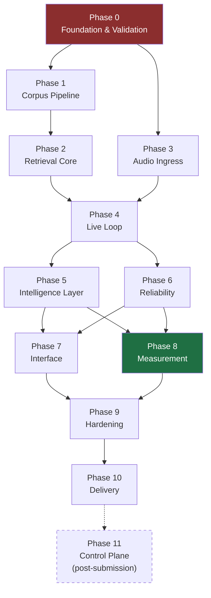

# KRONOS — Build Plan

Phase-ordered construction sequence. **No dates, no durations** — phases are ordered by
dependency and gated by exit criteria, not by a calendar. For the deadline-driven schedule,
see [SPEC.md](./SPEC.md) §18.

Each phase states: what it produces, what technology it uses, the order to build in, how you
know it's done, and how it typically fails.

> **Governing rule:** a phase is not complete until its exit criteria are *demonstrated*, not
> asserted. Phases gated on a measurement are not complete until the measurement exists.

---

## Dependency graph

Phases 1 and 3 are independent and can proceed in parallel. Phases 5 and 6 are independent of
each other. Everything else is strictly sequential.

---

## Phase 0 — Foundation & Validation

**Objective:** prove the three load-bearing technologies work in a browser before writing a
single line of product code.

### Why this phase exists

Every architectural assumption in KRONOS rests on three things behaving in a browser tab:
Moss retrieving in single-digit milliseconds, Whisper transcribing usable text from realistic
room audio, and MiniLM embedding fast enough to fit in the budget. If any of them fails, the
design changes. Discovering that after building a UI on top of it is the most expensive
mistake available in this project.

### Technology

| Concern | Choice |
|---|---|
| Monorepo | pnpm workspaces |
| Language | TypeScript, strict mode |
| App shell | Next.js 14 App Router |
| Styling | Tailwind CSS |
| Model runtime | `onnxruntime-web` (WASM + SIMD + threads) |
| Retrieval | **Moss** |
| ASR | `whisper-tiny.en`, quantised |
| VAD | Silero VAD (ONNX) |
| Embeddings | `all-MiniLM-L6-v2`, 384-dim, quantised |
| Testing | Vitest (unit), Playwright (integration) |

### Build order

1. Monorepo scaffold: workspaces, TS config, lint, Next.js skeleton that renders.
2. Configure COOP/COEP headers for `SharedArrayBuffer`. Do this now — it constrains every
   asset decision downstream, and finding out late that a CDN font breaks cross-origin
   isolation is a classic late-night failure.
3. **Spike A — Moss.** 200-vector index, 100 queries, record p50/p95. Determine worker
   compatibility and whether batch multi-query is supported.
4. **Spike B — far-field ASR.** Record the demo assertion at 4 ft, off-axis, in a
   hard-surfaced room. Transcribe in-browser. This is the spike that can invalidate the design.
5. **Spike C — MiniLM.** Batch of 4, record latency and cold start. Verify browser output
   matches Node output within float tolerance.
6. Record all three results in CHANGELOG. Revise architecture if B failed.

### Exit criteria

- [ ] Moss returns results in-tab at p95 < 10 ms
- [ ] Browser and Node embeddings agree within tolerance
- [ ] ASR outcome is **categorised**: pass / partial / fail — with the architectural response chosen
- [ ] Cross-origin isolation confirmed active (`self.crossOriginIsolated === true`)
- [ ] Spike numbers written down, not remembered

### How this phase fails

Skipping it. The second-most common failure is running the ASR spike with a headset on a quiet
desk, concluding it works, and discovering the real acoustics on demo day.

---

## Phase 1 — Corpus Pipeline

**Objective:** turn a contract into a Moss index whose chunks are complete, correctly labelled,
readable legal units.

### Why this phase carries the quality

Retrieval quality is bounded above by chunk quality. A perfect ranking over badly split text
still shows the user half a sentence. This phase deserves disproportionate effort, and the
inspector built at the end of it will save more debugging time than anything else in the project.

### Technology

| Concern | Choice | Note |
|---|---|---|
| PDF extraction | `unstructured` (Python) or `pdfplumber` | Needs coordinates, font size, weight for heading detection |
| DOCX | `mammoth` | Style names give structure directly |
| Fallback | `pdf.js` text layer | If layout tooling is too heavy |
| Embedding (offline) | Same MiniLM build as the browser | **Must be byte-identical** |
| Artifact | Packed `Float32Array` + JSON sidecar | See [LLD.md](./LLD.md) §5 |
| CLI | `tsx` + `commander` | |

### Build order

1. **Extraction** with coordinates and font metadata.
2. **Scanned-document rejection.** Heuristic: < 100 extractable characters per page across
   > 30% of pages ⇒ hard error. Refusing loudly beats embedding garbage silently.
3. **Normalisation:** de-hyphenate across line breaks, unify quotes, strip repeating
   headers/footers, preserve paragraph structure.
4. **Structure detection:** clause-numbering patterns, most specific first (see
   [SPEC.md](./SPEC.md) §5.2), corroborated by font deltas.
5. **Clause tree** construction.
6. **Legal-boundary chunking** — merge below `MIN_TOKENS`, split only at structural boundaries
   above `MAX_TOKENS`, never mid-sentence.
7. **Enrichment:** clause path, heading trail, cross-references, defined terms, structural
   signal flags (these flags are what Phase 5's stance labeller consumes — compute them once
   here, not per query).
8. **Embedding** — batch 32, L2-normalised.
9. **Artifact emission** with model fingerprint.
10. **Chunk inspector page** at `/inspect`, with automatic flagging of suspicious chunks.

### Exit criteria

- [ ] Demo contract produces chunks with **zero** mid-sentence splits
- [ ] Every chunk has a clause label and a heading trail
- [ ] Cross-references resolve to real chunk IDs
- [ ] Scanned PDF raises a clear error
- [ ] Artifact loads and reports a matching model fingerprint
- [ ] Inspector renders every chunk and flags the outliers

### How this phase fails

Building a token-count chunker "for now" and intending to fix it later. The fix never happens,
and the demo shows a clause that stops mid-clause.

---

## Phase 2 — Retrieval Core

**Objective:** a working query path — embed a string, search Moss, get ranked chunks back —
behind an interface that can be swapped.

### Technology

Moss, accessed exclusively through a `VectorIndex` adapter ([LLD.md](./LLD.md) §4.2). No Moss
types leak into application code.

### Build order

1. Define the `VectorIndex` interface.
2. Implement `MossIndex` against it.
3. Implement `BruteForceIndex` — a trivial cosine loop over the same artifact. Fifty lines,
   and it pays for itself three times: it is the correctness oracle for Moss's results, the
   fallback if the SDK misbehaves, and the baseline for the latency comparison.
4. Index loading with fingerprint verification and refusal on mismatch.
5. Browser-side embedding function, batch-capable.
6. Timing instrumentation wrapping every stage — built in now, never retrofitted.
7. A bare text-input test page: type a sentence, see ranked chunks with scores and timings.

### Exit criteria

- [ ] Typed query returns sensible ranked chunks
- [ ] Moss and brute force agree on top-3 for 20 test queries
- [ ] Per-stage timings emitted for every query
- [ ] Fingerprint mismatch is refused, loudly

### How this phase fails

Letting Moss-specific types spread through the codebase, so that a Phase 0 surprise becomes a
Phase 9 rewrite.

---

## Phase 3 — Audio Ingress

**Objective:** microphone to reliable utterance boundaries, with streaming transcription.

*Independent of Phases 1–2; can be built in parallel.*

### Technology

| Concern | Choice |
|---|---|
| Capture | `AudioWorklet`, 16 kHz mono, 512-sample frames |
| Buffer | Preallocated ring buffer, 30 s, `SharedArrayBuffer` |
| VAD | Silero VAD (ONNX) in a dedicated worker |
| ASR | Whisper WASM in a dedicated worker |
| Transport | `postMessage` with transferable buffers |

### Build order

1. `AudioWorklet` capture with resampling to 16 kHz. **The worklet must not allocate** — it
   runs on the realtime audio thread and a GC pause there produces audible dropouts.
2. Ring buffer over `SharedArrayBuffer` with atomic read/write cursors.
3. VAD worker: frame probabilities, `MIN_SPEECH_MS`, `HANGOVER_MS`, `PRE_ROLL_MS`.
   Emit `speechStart` and `speechEnd` events.
4. **Instrument `t_speech_end`.** This is the origin of the headline metric; everything
   downstream is measured from it.
5. Whisper worker: model load, warm-up inference during startup.
6. **Streaming decode loop** — incremental hypothesis every `CHUNK_INTERVAL_MS` during speech;
   final flush on `speechEnd`. This is the mechanism that makes the sub-second claim honest
   rather than a choice of measurement origin.
7. Domain-vocabulary prompt generated from the corpus's defined terms.
8. SNR estimation from VAD frame energy, for the Phase 6 confidence gate.
9. A test page: speak, see boundaries, partial hypotheses, final text, and timings.

### Exit criteria

- [ ] Utterance boundaries within ±150 ms of hand-labelled ground truth on recorded clips
- [ ] Final flush latency measured and inside budget
- [ ] `condition_on_previous_text: false` confirmed — no repetition loops on poor audio
- [ ] SNR estimate produced per utterance
- [ ] Domain prompt measurably improves recognition of corpus terms

### How this phase fails

Tuning `HANGOVER_MS` on your own clean speech. Too short and it cuts people off mid-sentence;
too long and the product feels slow. Tune it on recordings of real conversational speech with
natural pauses.

---

## Phase 4 — Live Loop

**Objective:** speak a sentence, see a clause. End to end, instrumented, ugly.

### Build order

1. Session state machine: `idle → loading → ready → armed → listening → retrieving → showing`
   ([LLD.md](./LLD.md) §7).
2. Wire `speechEnd` → final transcript → embed → Moss → top-3 → DOM.
3. Trigger: double-tap modifier detection, arm/disarm, `Esc` to clear.
4. Always-visible microphone indicator (consent requirement CR-2 — build it with the trigger,
   not after).
5. End-to-end timing record, `t_speech_end` through `t_paint` measured in `requestAnimationFrame`.
6. Debug overlay at `?debug=1`.

### Exit criteria

- [ ] A live spoken sentence produces a real clause from the real index
- [ ] Complete timing breakdown visible per query
- [ ] Microphone state is unambiguous at all times
- [ ] Ten consecutive utterances without a crash or a stuck state

### How this phase fails

Making it pretty. The interface is Phase 7. This phase exists to find integration problems.

---

## Phase 5 — Intelligence Layer

**Objective:** retrieve the clause that *answers* the assertion, not the one that restates it.

### Why this phase is the product

Everything before this is a voice-driven search box. This phase is the difference between a
system that works on the sentence you tuned it on and one that survives a judge inventing an
assertion on the spot.

### Build order

1. **Assertion parsing** — `{subject, obligation, instrument, qualifiers}`. Match against the
   corpus's own defined-term list first; those are the words that actually exist in the
   documents and are therefore the highest-signal tokens available.
2. **Query expansion** — four templated hypothetical clause forms (obligation, exception,
   definition, remedy). Template-driven, so it costs microseconds and cannot hallucinate.
3. **Batch embedding** of all four in a single forward pass.
4. **Multi-query retrieval** — top-10 per expansion.
5. **Reciprocal Rank Fusion** with per-expansion weights; `exception` up-weighted.
6. **Cross-reference expansion** — pull cited clauses into the pool at a score discount, so
   "notwithstanding §4.2" surfaces §4.2 alongside it.
7. **Stance labelling** from precomputed structural signals plus retrieval provenance plus
   cross-reference direction, emitting `stanceReasons` for every label.
8. **Baseline path** — keep naive single-query retrieval runnable behind a flag. Phase 8 needs
   it to compute lift, and a lift figure you can't reproduce is worthless.

### Exit criteria

- [ ] The adversarial assertion retrieves the carve-out, not the obligation
- [ ] Stance labels agree with hand-labelled ground truth on ≥ 85% of a 20-clause set
- [ ] Every label carries human-readable reasons
- [ ] Full expansion path stays inside the latency budget
- [ ] Baseline path runs on the same index for comparison

### How this phase fails

Tuning the RRF weights until the demo sentence works. That is overfitting to n=1, and it will
be exposed the first time someone asks an off-script question. Weights are set by Phase 8's
calibration sweep.

---

## Phase 6 — Reliability

**Objective:** never display a confident wrong answer.

*Independent of Phase 5; can be built in parallel.*

### Build order

1. Confidence inputs: ASR mean token logprob, `no_speech_prob`, SNR, top-1 similarity,
   rank-1/rank-2 margin.
2. Composite score ([SPEC.md](./SPEC.md) §8.1).
3. Three states — green / amber / red — with retrieval **not attempted** in red.
4. Amber rendering: collapsed closest match, recognised text made prominent.
5. Always-visible transcript strip.
6. Threshold constants in one module, with the calibration run that produced them recorded
   alongside.

### Exit criteria

- [ ] Deliberately garbled audio produces amber, never a confident wrong answer
- [ ] Silence and noise produce red without attempting retrieval
- [ ] Transcript is visible in every state
- [ ] Thresholds live in one place and are documented

### How this phase fails

Treating it as polish and deferring it. It is the input-layer defence against Whisper's
fabrication behaviour, which is the highest-probability failure in the entire system.

---

## Phase 7 — Interface

**Objective:** readable by someone who is simultaneously holding a conversation.

### Build order

1. Compact panel, ~420 px, bottom-right. Not full-screen — the user is looking at a person,
   and the content is confidential in a room that may contain others.
2. Clause card: stance label, document and clause reference, verbatim text, confidence,
   reasons on hover.
3. Bold the matched span so the eye lands in the right place.
4. Colour: green border for supports, amber for against, grey for context. **Never red for
   "against"** — red reads as *error*, and that clause is correct information.
5. Maximum three cards, no scrolling.
6. 120 ms crossfade on replacement. No spinners — a spinner requests attention the user
   cannot give.
7. Panic-hide hotkey.
8. Typography: ≥ 16 px, 1.5 line height, high contrast.

### Exit criteria

- [ ] Readable at a glance from normal seating distance
- [ ] No layout shift when results arrive
- [ ] Nothing requires scrolling
- [ ] Panic-hide is instant

### How this phase fails

Designing for a screenshot rather than for peripheral vision during a conversation.

---

## Phase 8 — Measurement

**Objective:** replace every `[TARGET]` with a `[MEASURED]` number, or delete the claim.

### Why this phase decides the outcome

Almost every competing submission will present a demo. Very few will present a calibration
sweep and a baseline comparison on the same data. This phase is where the work of Phase 5
becomes *provable* rather than merely claimed.

### Build order

1. **Dataset** — 50 labelled assertion→clause pairs, of which 15 are adversarial: chosen
   specifically because naive single-query similarity gets them wrong.
2. **Recorded audio** for a subset, captured under realistic acoustics.
3. `run-recall.ts` — recall@1/3/5 and MRR, overall and adversarial.
4. `run-baseline.ts` — the same metrics for naive retrieval, same index, same data.
5. `run-latency.ts` — per-stage p50/p95 over ≥ 30 runs, Moss isolated.
6. `run-asr.ts` — WER, and the correlation between ASR confidence and retrieval correctness.
7. `calibrate.ts` — sweep RRF weights and `C_AMBER`; select for maximum recall subject to
   false-confident ≤ 5%.
8. Charts and `RESULTS.md`, hardware-stamped and committed.

### Exit criteria

- [ ] Every performance claim in README and PRD is `[MEASURED]`
- [ ] Lift over baseline computed on identical data
- [ ] Thresholds chosen by sweep, not by hand
- [ ] False-confident rate measured
- [ ] Results reproducible with one command

### How this phase fails

Running out of time and reporting a single hand-timed number. If compressed, cut recall work
before latency work — latency is cheaper to measure honestly.

---

## Phase 9 — Hardening

**Objective:** make the privacy claims machine-verified, and make first load survive a stranger.

### Build order

1. **Zero-egress test** (Playwright): record the network log across a full session, assert
   zero requests after load completes.
2. **Zero-persistence test**: assert `localStorage`, `sessionStorage`, `IndexedDB`, Cache API,
   and OPFS are all empty after a session.
3. Strict CSP: `connect-src 'self'`. Remove every third-party asset — fonts, analytics, error
   reporting. Bundle everything.
4. Cold-start work: parallel fetch, byte-accurate progress, lazy Whisper load, runtime warm-up.
5. **Demo mode** — bundled audio through the identical pipeline. Same VAD, same ASR, same
   embedding, same Moss, same HUD. Only the audio source differs.
6. Latency regression test in CI against the committed budget.
7. Error boundaries: no crash surfaces a stack trace to a user in a boardroom.

### Exit criteria

- [ ] Egress and persistence tests pass and are part of CI
- [ ] Cold start measured on a clean profile and disclosed
- [ ] Demo mode works with the microphone denied
- [ ] Warm-up eliminates the first-query penalty
- [ ] No unhandled error path reaches the UI

### How this phase fails

Assuming the deployed build behaves like the dev build. COOP/COEP and CSP problems surface
only in production.

---

## Phase 10 — Delivery

**Objective:** a stranger opens a URL and understands the product in ninety seconds.

### Build order

1. Deploy. Verify on a **clean profile, incognito, microphone denied** — the state a judge
   will actually open it in.
2. Architecture diagram exported from the Mermaid source.
3. Documentation final pass; every number labelled and sourced.
4. Rehearse the live demo repeatedly, including deliberately triggering the amber state.
5. Judge Q&A rehearsal ([SPEC.md](./SPEC.md) §20) — aloud, until the answers don't need thought.
6. Record video per the shot list, observing the video prohibitions.
7. Submit with buffer.

### Exit criteria

- [ ] Public URL works on hardware you have never used
- [ ] Video shows the honest timer, the unedited network panel, the Moss timing, and an amber state
- [ ] Built-vs-roadmap stated out loud
- [ ] All five required artifacts submitted

### How this phase fails

Deploying for the first time on the last day.

---

## Phase 11 — Control Plane *(post-submission)*

**Objective:** the multi-tenant enterprise system around the browser client.

Not part of the hackathon submission. Specified so the browser client's interfaces are
designed to accept it rather than needing rework. Full design in [HLD.md](./HLD.md) §6 and
[LLD.md](./LLD.md) §6.

### Scope

| Service | Responsibility |
|---|---|
| Identity & Access | Tenants, users, WebAuthn credentials, device binding |
| Matter Management | Deals, document sets, membership, permissions |
| Ingest Service | Async parse → chunk → embed → artifact. Runs in the customer's residency zone |
| Artifact Provisioning | Envelope-encrypted artifact delivery, short-lived grants |
| Audit Service | Append-only, hash-chained event log |
| Key Management | KMS-backed envelope encryption, per-matter data keys |

### Principles carried forward

- Control plane and data plane stay separate. The control plane never sees plaintext deal
  content; it handles metadata, grants, and encrypted blobs.
- Ingest runs inside the customer's residency boundary. Only ciphertext crosses it.
- Every artifact delivery is an audit event. Legal customers need to answer "who saw what,
  when," and that answer must be tamper-evident.
- The browser client's zero-egress guarantee holds unchanged: the control plane is contacted
  during load, never during a session.

---

## Cross-cutting practices

These apply within every phase, not after them.

| Practice | Rule |
|---|---|
| **Instrumentation** | Added when the code path is written, never retrofitted |
| **Interfaces at boundaries** | Moss, ASR, and embedding sit behind adapters. Each is one file to replace |
| **Fail loud at ingest, fail soft at runtime** | A malformed document is a hard error; a low-confidence query is an amber state |
| **One source of truth for constants** | Every threshold in one module, with the run that justified it |
| **Golden tests over assertions** | Chunking and stance labelling are judged against committed hand-labelled fixtures |
| **Number discipline** | `[TARGET]` or `[MEASURED]`, always, everywhere |
| **Changelog** | Every phase completion and every decision recorded with reasoning |

---

## Technology summary

| Layer | Technology | Rationale |
|---|---|---|
| App shell | Next.js 14 (App Router), TypeScript strict | Deployed-link requirement; trivial hosting |
| Styling | Tailwind CSS | Speed |
| Audio capture | `AudioWorklet`, `SharedArrayBuffer` ring buffer | Realtime-safe, zero-copy |
| VAD | Silero VAD (ONNX) | Robust in rooms with HVAC and paper noise |
| ASR | `whisper-tiny.en` quantised, WASM | Small; English-only beats multilingual at equal size |
| Embeddings | `all-MiniLM-L6-v2` 384-dim, quantised | Fast, well-understood, identical offline and online |
| Runtime | `onnxruntime-web` (WASM/SIMD/threads) | Mature WASM SIMD support |
| **Retrieval** | **Moss** | Sub-10 ms, in-tab, no vector DB — makes privacy and latency compatible |
| Document parsing | `unstructured` / `pdfplumber` | Layout awareness for clause detection |
| Monorepo | pnpm workspaces | |
| Testing | Vitest, Playwright | Playwright is what makes the egress claim machine-checkable |
| Deploy | Vercel with COOP/COEP | Required for `SharedArrayBuffer` |
| Control plane *(P11)* | Go or Node, PostgreSQL, S3-compatible object store, KMS | Standard, boring, auditable |
