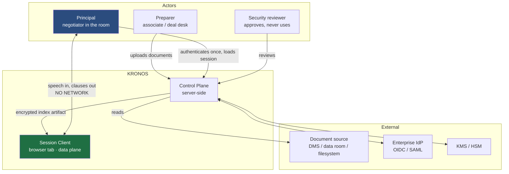
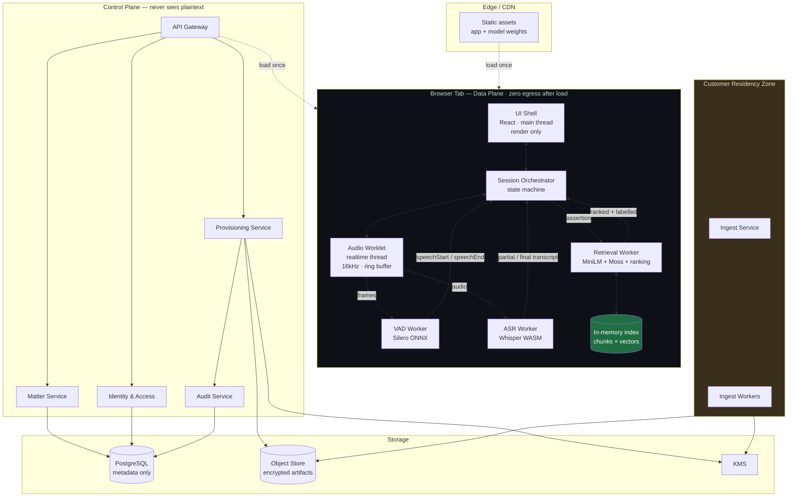
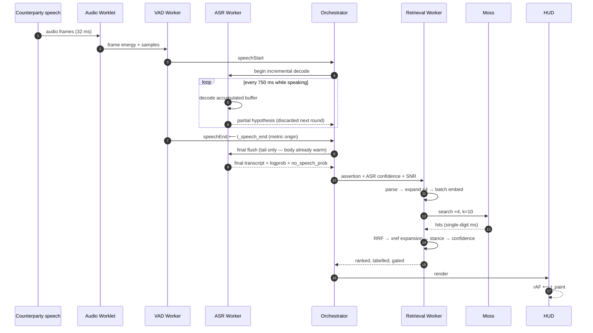
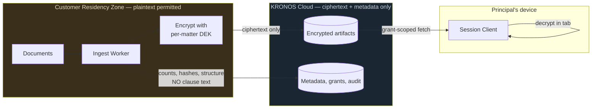
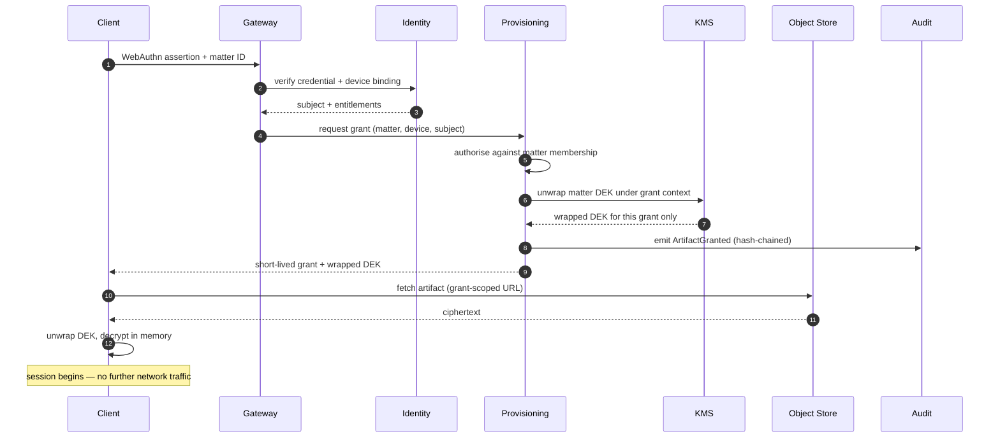
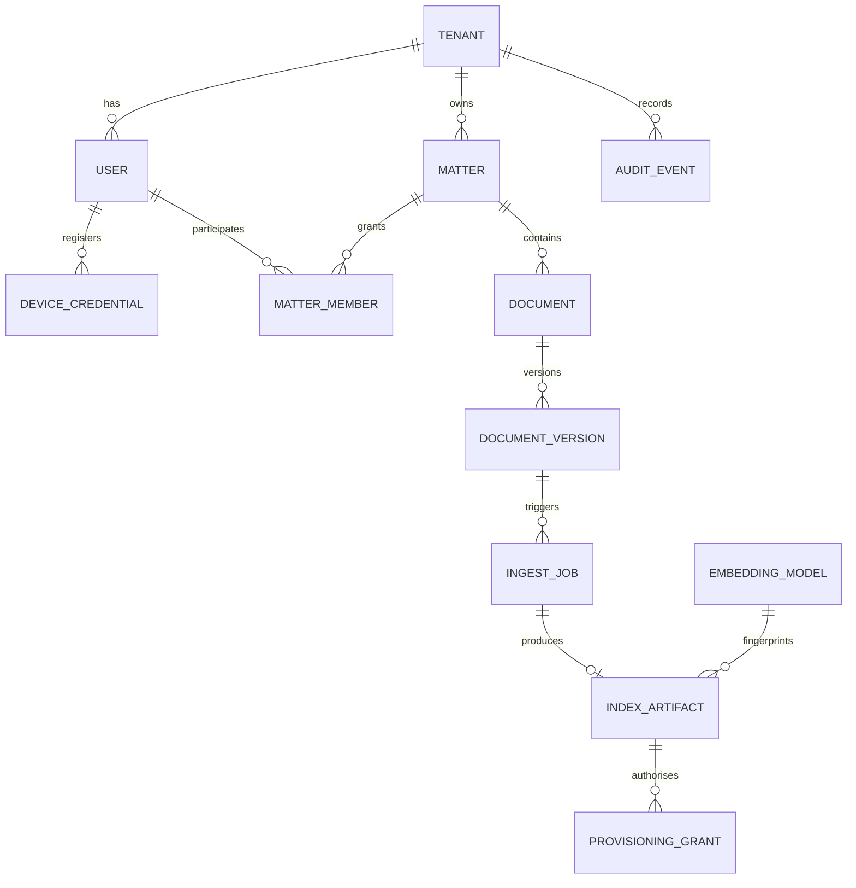

# KRONOS — High-Level Design (HLD)

System architecture, service decomposition, data architecture, and the reasoning behind each.
Low-level detail — schemas, class definitions, API contracts, algorithms — is in
[LLD.md](./LLD.md).

| Field | Value |
|---|---|
| Version | 1.0 |
| Scope | Hackathon client **and** the production system it grows into |
| Companion docs | [PRD.md](./PRD.md) · [SPEC.md](./SPEC.md) · [BUILD_PLAN.md](./BUILD_PLAN.md) · [LLD.md](./LLD.md) |

---

## 0. Reading this document

KRONOS is unusual for a system-design exercise: **its request path has no servers in it.**
The privacy requirement forces all inference and retrieval into the client, which means the
classic microservice decomposition does not apply to the hot path at all.

That is a design outcome, not an omission. The correct architecture here is:

- a **data plane** that is entirely client-side, latency-critical, and offline after load; and
- a **control plane** that is server-side, latency-tolerant, and never touches plaintext deal content.

This document specifies both. §1–§5 cover the client (what the hackathon builds); §6–§9 cover
the control plane (what productionising requires). Anyone evaluating the design should read
§1.2 first — the constraint hierarchy explains every subsequent decision.

---

## 1. Context and constraints

### 1.1 System context (C4 level 1)



The heavy line between Principal and Session Client is the product. It carries no network
traffic.

### 1.2 The constraint hierarchy

Constraints are ordered. When two conflict, the higher one wins, and every design decision in
this document can be traced to this ordering.

| Rank | Constraint | Consequence |
|---|---|---|
| **1** | Deal content must not leave the device during a session | All inference and retrieval are client-side. No hosted vector DB. No inference API. This eliminates most conventional architectures outright |
| **2** | Must never present a confident wrong clause | A reliability gate sits in front of the UI. Refusing is an acceptable, designed outcome |
| **3** | Response must be imperceptible within a conversational turn | Retrieval gets a single-digit-millisecond budget. This is the Moss requirement |
| **4** | Retrieved text must be a complete, readable legal unit | Structural chunking at ingest, not token windowing |
| **5** | Operator must not appear to be operating a machine | Arm-and-forget trigger, peripheral-vision UI, no spinners |
| **6** | Must be auditable by a security reviewer | Machine-verified egress and persistence claims; tamper-evident audit log in the control plane |

> [!IMPORTANT]
> Constraint 1 is what makes this an interesting system-design problem. It inverts the normal
> topology: the expensive computation runs on the least powerful, least controlled machine in
> the system, and the servers are relegated to provisioning. Every subsequent decision is
> downstream of accepting that inversion rather than fighting it.

### 1.3 Design principles applied

| Principle | Application here |
|---|---|
| **Move computation to data** | Data cannot move, so computation moves to it. The entire architecture follows |
| **Separate control and data planes** | Provisioning is slow, stateful, server-side; retrieval is fast, ephemeral, client-side. They share no code path and fail independently |
| **Fail-safe defaults** | Low confidence renders amber. A missing index refuses to start. A fingerprint mismatch aborts. The default is always "don't answer" |
| **Precompute the invariant** | Chunking, enrichment, structural signals, and embeddings are computed once at ingest. The hot path does retrieval and ranking only |
| **Bounded resources everywhere** | Ring buffers, capped transcript history, fixed top-k, max three cards. Nothing on the hot path grows without limit |
| **Interface segregation at volatile boundaries** | Moss, ASR, and embeddings each sit behind a narrow adapter — the three components most likely to change |
| **Make the guarantee testable** | "No egress" is a Playwright assertion, not a sentence in a README |
| **Idempotency** | Ingest is keyed by content hash; re-ingesting is a no-op. Artifact builds are reproducible |
| **Least privilege** | Provisioning grants are per-matter, per-device, short-lived, single-use |
| **Graceful degradation** | Moss → brute force; expansion → naive; streaming ASR → batch; live mic → demo mode. Every layer has a defined worse-but-working mode |

---

## 2. Container architecture (C4 level 2)



### 2.1 Why the client is decomposed this way

The split is driven by **thread isolation**, not by module tidiness. Each context has a
different failure and latency profile:

| Container | Thread | Latency profile | Failure mode if co-located |
|---|---|---|---|
| UI Shell | Main | Must never block > 16 ms | Any co-located work causes visible jank indistinguishable from latency |
| Audio Worklet | Realtime audio | Hard realtime; must not allocate | A GC pause here drops audio frames irrecoverably |
| VAD Worker | Worker | Steady small CPU, every 32 ms | Competes with ASR if shared |
| ASR Worker | Worker | Bursty, hundreds of ms | Would block VAD and starve boundary detection |
| Retrieval Worker | Worker | Bursty, tens of ms | Would block paint at exactly the wrong moment |

This is the same reasoning as service isolation in a distributed system — isolate by failure
domain and latency class — applied inside a single tab.

---

## 3. Data plane: session architecture

### 3.1 Request path



**Reported metric:** `t_paint − t_speech_end`. Selected because it is the interval the user
experiences as waiting, and because a streaming architecture can legitimately claim credit for
it. The VAD hangover constant and cold-start cost are disclosed separately rather than folded
in ([PRD.md](./PRD.md) §6).

### 3.2 Why streaming is architectural, not an optimisation

A buffer-then-transcribe design has a floor equal to the buffer length — several seconds — no
matter how fast the rest of the pipeline is. No amount of retrieval speed rescues it. Streaming
decode converts the dominant term into work performed *during* the speech, leaving only a tail
flush after it. This single decision is what makes constraint 3 satisfiable, and it is why
Moss's speed becomes visible rather than being lost in noise.

### 3.3 Degradation ladder

Each layer has a defined worse-but-working mode, so no single failure takes the system down:

| Layer | Primary | Degraded | Floor |
|---|---|---|---|
| Retrieval | Moss | Brute-force cosine | — |
| Ranking | Expansion + RRF + stance | Naive single-query | Unlabelled ranked list |
| ASR | Streaming incremental | Batch on utterance | Red state |
| Audio | Live microphone | Bundled demo audio | Text input box |
| Confidence | Calibrated composite | Similarity threshold only | Always-amber |

---

## 4. Data architecture (client)

### 4.1 What lives in the tab

| Structure | Backing | Lifetime | Bound |
|---|---|---|---|
| Chunk metadata | JS objects | Session | Corpus size |
| Vectors | Packed `Float32Array` | Session | `chunks × 384 × 4` bytes |
| Moss index | Moss-internal | Session | — |
| Audio ring | `SharedArrayBuffer` | Continuously overwritten | 30 s, fixed |
| Transcript history | Bounded array | Session | Last N utterances |
| Timing records | Bounded array | Session | Last 100 queries |

**Nothing is written to any storage API.** Enforced by test, not convention ([SPEC.md](./SPEC.md) §13.2).

### 4.2 Memory sizing, honestly

Frequently mis-stated, so stated precisely:

```
vectors  = chunks × 384 dims × 4 bytes
20-page contract   ≈    200 chunks →  0.3 MB
500-page set       ≈  5,000 chunks →  7.7 MB
10,000-page room   ≈ 100,000 chunks → 154 MB
```

The corpus is **not** the memory constraint at realistic sizes. The binding constraints are
**model download** (tens of MB) and **cold start**. Any design discussion that invokes WASM
memory ceilings for a contract corpus has misidentified the bottleneck — see
[SPEC.md](./SPEC.md) §12.1.

### 4.3 Index artifact

An immutable, content-addressed, versioned blob containing a header (version, model
fingerprint, dimensions, counts), a packed vector block, and chunk metadata. Immutability
enables aggressive caching and makes reproducibility trivial. The model fingerprint is checked
at load and refused on mismatch — a quantisation mismatch between ingest and query produces
plausible-but-wrong retrieval that is nearly invisible in a demo, so it is made structurally
impossible instead. Binary layout in [LLD.md](./LLD.md) §5.

---

## 5. Client component responsibilities

| Component | Owns | Does not own |
|---|---|---|
| **UI Shell** | Render, hotkeys, paint timing | Any inference or ranking |
| **Session Orchestrator** | State machine, worker lifecycle, correlation IDs, timing assembly | Domain logic |
| **Audio Worklet** | Capture, resample, ring buffer writes | Decisions of any kind |
| **VAD Worker** | Speech probability, boundaries, SNR | Transcription |
| **ASR Worker** | Incremental + final decode, confidence signals | Retrieval |
| **Retrieval Worker** | Parse, expand, embed, search, fuse, label, gate | Rendering |
| **Index Adapter** | Load, verify, search | Ranking policy |

Single responsibility, enforced by the worker boundary. A module that needs to reach across a
boundary is a design error, not a convenience.

---

## 6. Control plane (production)

*Not built for the hackathon. Specified so client interfaces accept it without rework, and so
the security story has a credible end state.*

### 6.1 Service decomposition

Services are bounded by **data sensitivity and failure domain**, which for this product is a
sharper boundary than the usual business-capability decomposition — the difference between a
service that can see plaintext and one that cannot is the difference that matters.

| Service | Responsibility | State | Sync/Async | Availability target |
|---|---|---|---|---|
| **API Gateway** | TLS, authn, rate limit, routing | Stateless | Sync | 99.95% |
| **Identity & Access** | Tenants, users, roles, WebAuthn credentials, device binding | PostgreSQL | Sync | 99.95% |
| **Matter Service** | Deals, document sets, membership, permissions | PostgreSQL | Sync | 99.9% |
| **Ingest Service** | Accept documents, enqueue jobs, report status | PostgreSQL + queue | Async | 99.5% |
| **Ingest Worker** | Parse → chunk → enrich → embed → encrypt → artifact | Stateless | Async | Best effort |
| **Provisioning Service** | Issue short-lived grants, serve encrypted artifacts | Stateless + KMS | Sync | 99.95% |
| **Audit Service** | Append-only, hash-chained event log | PostgreSQL | Async write, sync read | 99.9% |
| **Key Management** | Envelope encryption, per-matter data keys | KMS/HSM | Sync | 99.99% |

### 6.2 The residency boundary

The single most important structural decision in the control plane:



The ingest worker is the only component that ever sees plaintext, and it is deployed inside the
customer's boundary (their VPC, or on-premises). The vendor cloud holds ciphertext and
metadata — chunk counts, structural hashes, clause labels, never clause text.

This means a full compromise of KRONOS Cloud yields encrypted blobs and document structure,
not deal content. That is a claim a security reviewer can verify from an architecture diagram,
which is worth considerably more than a claim that requires trusting an implementation detail.

### 6.3 Provisioning flow



Grants are **per-matter, per-device, short-lived, single-use.** Every issuance is an audit
event. The client's zero-egress guarantee begins the moment the artifact is decrypted and holds
for the rest of the session.

### 6.4 Why these are separate services

Justified individually, because "microservices" is a cost as well as a structure and each split
should earn its keep:

| Split | Justification |
|---|---|
| Ingest Worker separate from everything | Only component touching plaintext; must be deployable inside a customer boundary. This is a **trust boundary**, the strongest possible reason to split |
| Provisioning separate from Matter | Different availability class and blast radius. Provisioning is on the critical path to a live negotiation; matter CRUD is not |
| Audit separate and append-only | Tamper-evidence requires that no business service can mutate it. Enforced at the database grant level |
| Identity separate | Standard; enables IdP federation without touching domain services |
| Gateway separate | Terminates TLS and authn once, so no domain service reimplements it |

What is **not** split: matter and document management share a service, because they share a
transaction boundary and splitting them would require distributed transactions to maintain an
invariant that a single database enforces for free. Splitting for its own sake is how teams
acquire a distributed monolith.

---

## 7. Data architecture (control plane)

### 7.1 Storage selection

| Store | Technology | Holds | Why |
|---|---|---|---|
| Relational | PostgreSQL | Tenants, users, matters, documents, artifact metadata, grants, audit | Strong consistency for authorisation; these are relational entities and the write volume is low |
| Object | S3-compatible | Encrypted artifacts, encrypted source documents | Large immutable blobs; content-addressed; lifecycle policies |
| Queue | SQS / Redis Streams | Ingest jobs | Decouples slow parsing from the API |
| Secrets | KMS / HSM | Root keys, wrapped DEKs | Never in the application database |
| Cache | None on the critical path | — | Deliberate. Caching authorisation decisions is how stale grants become incidents |

### 7.2 Key entities

Full DDL in [LLD.md](./LLD.md) §6.2.



### 7.3 Data classification

The schema is designed around this table — it dictates what may be stored where.

| Class | Examples | Where it may live | At rest |
|---|---|---|---|
| **Plaintext deal content** | Clause text, embeddings | Customer residency zone; client memory | Never stored in vendor cloud |
| **Ciphertext** | Encrypted artifacts | Vendor object store | AES-256-GCM, per-matter DEK |
| **Structural metadata** | Chunk counts, clause labels, hashes | Vendor PostgreSQL | Encrypted at rest |
| **Identity** | Users, credentials | Vendor PostgreSQL | Encrypted; PII-tagged |
| **Audit** | Who accessed what, when | Vendor PostgreSQL | Append-only, hash-chained |

> Clause **labels** (`§4.2.1(b)`) are metadata; clause **text** is content. The boundary is
> drawn there deliberately — labels are needed for the UI and support, and they leak
> structure but not substance.

### 7.4 Retention

| Data | Retention | Mechanism |
|---|---|---|
| Session audio | Zero | Never leaves the ring buffer |
| Session transcripts | Zero | Memory only, discarded on tab close |
| Encrypted artifacts | Matter lifetime + configurable hold | Object lifecycle policy |
| Grants | 24 h after expiry | Scheduled purge |
| Audit events | 7 years | Legal default; per-tenant override |
| Source documents | Customer-controlled | May be reference-only, never copied |

---

## 8. Cross-cutting concerns

### 8.1 Security architecture

**Trust boundaries**, ordered from least to most trusted:

```
Public internet
  └─ CDN / static assets ........... integrity via SRI, no secrets
      └─ API Gateway ............... TLS, authn, rate limiting
          └─ Control plane ......... ciphertext + metadata only
              └─ KMS ............... root keys, never exported
Customer residency zone ............ plaintext permitted, customer-controlled
Principal's browser tab ............ plaintext in memory, zero egress
```

**Authentication:** WebAuthn with device binding, federated to the enterprise IdP. Device
binding matters because the threat is a valid credential used on an unmanaged machine.

**Authorisation:** matter-scoped RBAC, evaluated at provisioning time. Not cached — a stale
authorisation decision on a matter someone was removed from is precisely the incident this
product cannot survive.

**Encryption:** envelope, per-matter DEKs wrapped by a tenant KEK in KMS. Per-matter granularity
means revoking access to one deal does not require re-encrypting everything else.

**What is explicitly not claimed:** WASM linear memory is not an enclave; the client does not
defend against a compromised browser, a malicious extension, or physical access to an unlocked
device. Stated in the README, the PRD, and the demo ([SPEC.md](./SPEC.md) §13.3).

### 8.2 Observability

The unusual constraint: **the session cannot be observed.** Any telemetry from a live session
risks exfiltrating content, and the zero-egress guarantee forbids the network call regardless.

Resolution:

| Plane | Approach |
|---|---|
| Session | **No telemetry.** Timing records are in-memory and user-visible via the debug overlay. The user may export them manually |
| Control plane | Conventional: structured logs, RED metrics, distributed tracing across services |
| Ingest | Job-level metrics — duration, chunk counts, failure classes. **Never document content** |
| Audit | Separate from observability; it is a compliance artifact, not a debugging tool |

This is a real trade: production debugging of client issues relies on user-reported timing
exports rather than aggregated metrics. Accepted, because the alternative violates constraint 1.

### 8.3 Scalability

| Dimension | Characteristic | Implication |
|---|---|---|
| Concurrent sessions | Unlimited by design | Sessions consume **zero** server resources. The product's scaling story is that its expensive path doesn't touch the fleet |
| Provisioning | One request per session start | Trivially horizontal, stateless |
| Ingest | CPU-bound, bursty, offline | Queue-backed worker pool; autoscale on depth. Slow is acceptable — it runs the night before |
| Artifact delivery | Large immutable blobs | Object store plus CDN, grant-scoped URLs |
| Corpus size per matter | Bounded by client memory and cold start | Bounded above around 10k pages; beyond that, shard by matter or sub-agreement |

The architecture's most attractive economic property: **the compute cost of the product does
not grow with usage**, only with document ingestion.

### 8.4 Failure modes

| Failure | Blast radius | Behaviour | Recovery |
|---|---|---|---|
| Control plane down | New sessions only | Already-loaded sessions are **unaffected** — they need no network | Retry; artifacts are cached |
| KMS unavailable | New sessions | Cannot provision | KMS is 99.99%; grant reuse window absorbs brief outages |
| Ingest worker crash | One job | Job retried, idempotent by content hash | Automatic |
| Object store degraded | New sessions | Cannot fetch artifacts | Multi-region replication |
| Moss fails in client | One session | Fall back to brute force | Degraded latency, correct results |
| ASR fails in client | One session | Red state, text input fallback | User-visible, honest |
| Audit write fails | Compliance | **Fail closed** — provisioning is refused | Alert; this is the one place unavailability beats unlogged access |

The standout property: **a total control-plane outage does not interrupt a negotiation in
progress.** That is a direct consequence of the offline data plane, and it is the kind of
resilience that is very hard to retrofit.

---

## 9. Architecture decision records

Condensed ADRs. Each records the decision, the alternatives, and what would reverse it.

### ADR-001 — Client-side inference and retrieval
**Decision:** all inference and retrieval run in the browser.
**Alternatives:** server-side RAG; hybrid with server retrieval.
**Rationale:** constraint 1 admits nothing else. A single confidential clause crossing the
network voids the product.
**Consequences:** cold start becomes a first-class problem; no server-side observability;
corpus size bounded by client memory.
**Reversed by:** a customer accepting a VPC-hosted retrieval tier — in which case the adapter
in §5 is the seam.

### ADR-002 — Moss rather than a hosted vector database
**Decision:** Moss, in-tab.
**Alternatives:** Pinecone/Weaviate (violates ADR-001); hand-rolled brute force; HNSW in WASM.
**Rationale:** the only stage with no latency slack. Brute force is viable for small corpora and
is retained as the fallback and correctness oracle, but does not scale to a full data room.
**Consequences:** dependency on an SDK behaving in-browser — mitigated by the adapter and
validated in Phase 0.

### ADR-003 — Streaming ASR rather than fixed-window capture
**Decision:** incremental decode during speech; tail flush at the boundary.
**Alternatives:** buffer-then-transcribe.
**Rationale:** a fixed window makes the capture duration the dominant latency term, and no
downstream speed can recover it. This decision is what makes the latency claim honest.
**Consequences:** more complex worker protocol; discarded partial hypotheses; VAD tuning
becomes a first-class concern.

### ADR-004 — Structural chunking rather than token windowing
**Decision:** chunk on clause boundaries; never split mid-sentence.
**Alternatives:** fixed tokens with overlap.
**Rationale:** the unit of display is the unit of retrieval. A half-clause is worse than no
clause when the user reads it aloud.
**Consequences:** parser complexity; variable chunk sizes; scanned documents must be rejected.

### ADR-005 — Multi-query expansion with rank fusion
**Decision:** expand each assertion into four hypothetical clause forms, fuse with RRF.
**Alternatives:** naive single-query; LLM-based rewriting; cross-encoder rerank.
**Rationale:** similarity to an assertion retrieves the obligation, not its rebuttal. LLM
rewriting reintroduces latency and hallucination; templates cost microseconds and cannot invent.
**Consequences:** 4× embedding work (mitigated by batching); weights require calibration.

### ADR-006 — Control plane never sees plaintext
**Decision:** ingest runs in the customer's residency zone; the vendor holds ciphertext and
metadata only.
**Alternatives:** vendor-side ingest with encryption at rest.
**Rationale:** a vendor that can decrypt is a vendor that must be trusted, and enterprise legal
does not extend that trust to a startup. Structural separation is verifiable from a diagram;
"we encrypt at rest" is not.
**Consequences:** deployment complexity; customer-managed infrastructure; harder support.

### ADR-007 — No session telemetry
**Decision:** the client emits nothing.
**Alternatives:** anonymised metrics; opt-in telemetry.
**Rationale:** any session network call weakens a guarantee whose value depends on being
absolute. "We only send anonymised metrics" is a footnote that costs the entire claim.
**Consequences:** no aggregate performance visibility; user-exported timings only.

### ADR-008 — Fail closed on audit write failure
**Decision:** if the audit event cannot be written, provisioning is refused.
**Alternatives:** best-effort logging; async with retry.
**Rationale:** for a legal-sector product, unlogged access to deal documents is a worse
outcome than denied access.
**Consequences:** audit availability becomes a hard dependency of provisioning.

---

## 10. What the hackathon actually builds

Mapping design to submission scope, so the boundary is unambiguous:

| Layer | Hackathon | Production |
|---|---|---|
| Session client | **Fully built** | Same, hardened |
| Ingest pipeline | **Built** — local CLI | Service + worker pool in residency zone |
| Index artifact | **Built** — plaintext, static | Envelope-encrypted, grant-delivered |
| Identity | Not built | WebAuthn + IdP federation |
| Provisioning | Not built | Grant issuance + KMS |
| Audit | Not built | Hash-chained append-only log |
| Database | Not built — **designed** ([LLD.md](./LLD.md) §6.2) | PostgreSQL |

The client is the whole product from the user's point of view; the control plane is what makes
it sellable. Building the client first is the right order, and the interfaces above are
designed so the control plane attaches without rework.
