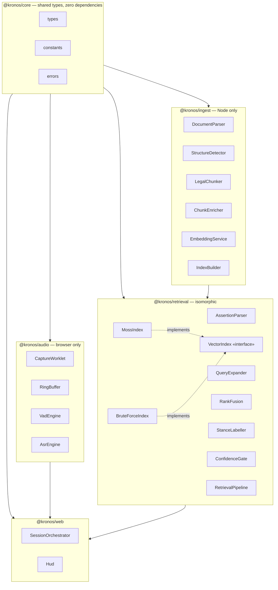
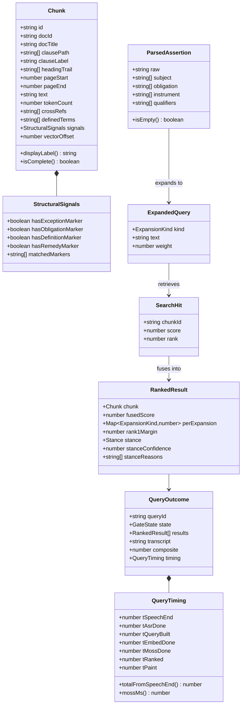
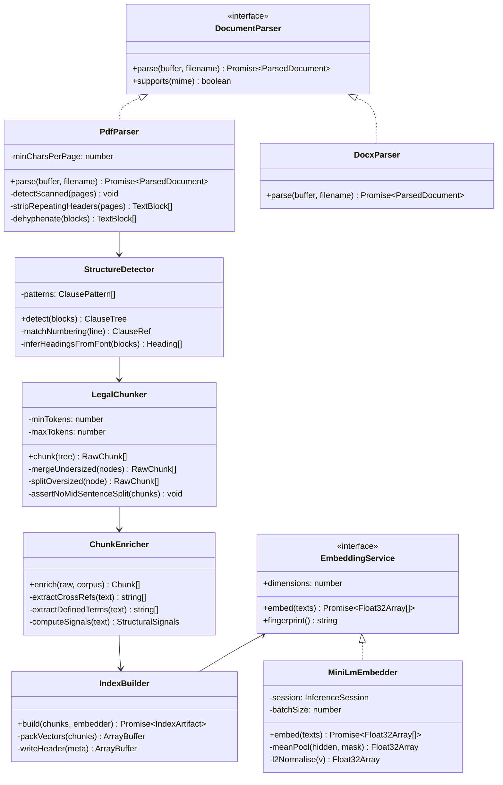
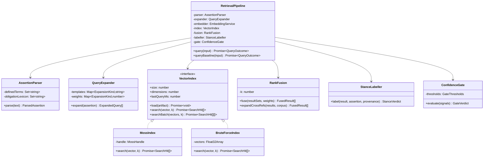
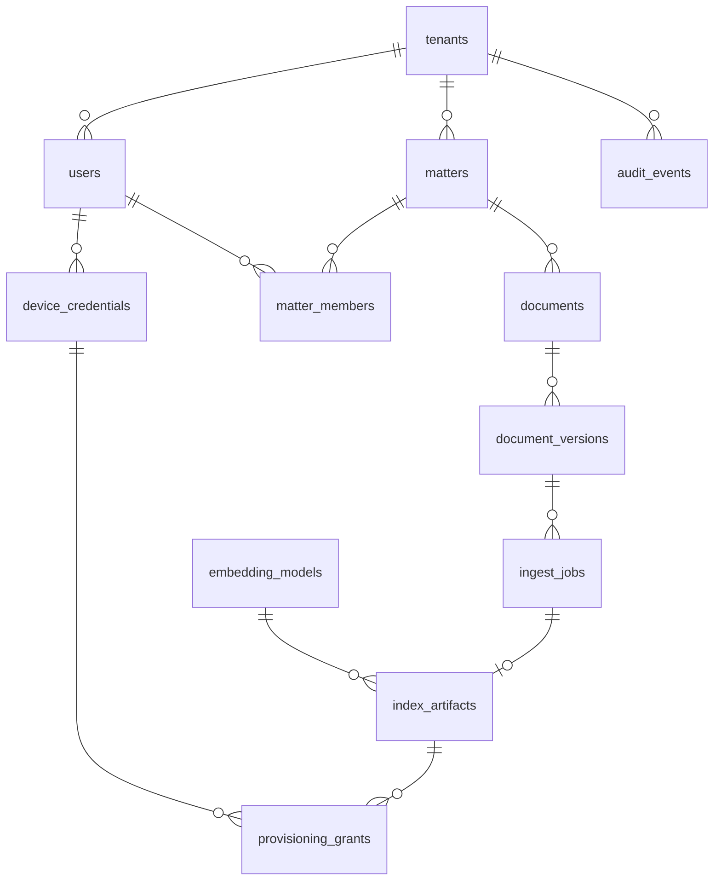
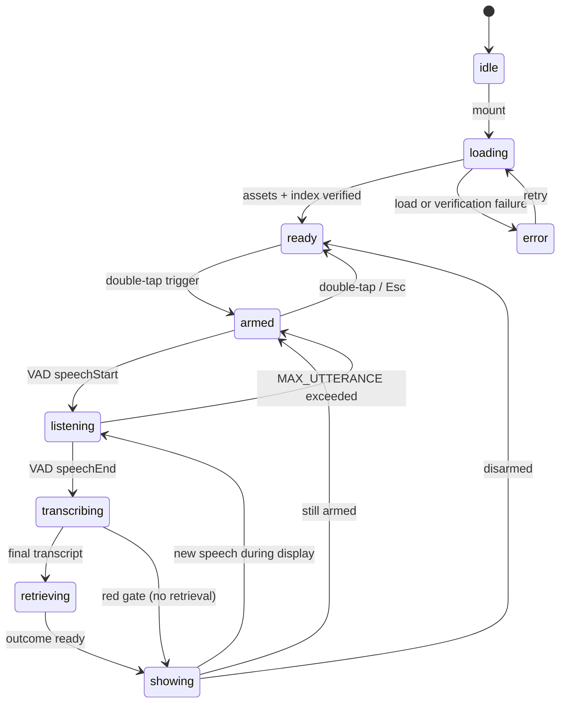

# KRONOS — Low-Level Design (LLD)

Implementation-level design: class structures, interfaces, database schema, binary formats,
API contracts, worker protocols, state machines, and algorithms.

Architecture and rationale are in [HLD.md](./HLD.md). Operational parameters and constants are
in [SPEC.md](./SPEC.md). This document is the reference you write code against.

| Field | Value |
|---|---|
| Version | 1.0 |
| Language | TypeScript (strict), PostgreSQL 15+ |
| Conventions | Interfaces prefixed `I` only where a class shares the name. `readonly` by default. No `any` |

---

## Contents

1. [Module map](#1-module-map)
2. [Domain model](#2-domain-model)
3. [Ingest classes](#3-ingest-classes)
4. [Retrieval classes](#4-retrieval-classes)
5. [Index artifact format](#5-index-artifact-format)
6. [Control-plane data model](#6-control-plane-data-model)
7. [Session state machine](#7-session-state-machine)
8. [Worker protocol](#8-worker-protocol)
9. [Control-plane API](#9-control-plane-api)
10. [Algorithms](#10-algorithms)
11. [Error taxonomy](#11-error-taxonomy)
12. [Concurrency and backpressure](#12-concurrency-and-backpressure)
13. [Configuration](#13-configuration)
14. [Traceability matrix](#14-traceability-matrix)

---

## 1. Module map



**Dependency rule:** `core` depends on nothing. `retrieval` is isomorphic — it must run
unchanged in Node, because the eval harness runs it headless. `ingest` is Node-only, `audio`
is browser-only, and neither may be imported by the other.

---

## 2. Domain model



### 2.1 Enumerations

```typescript
export type ExpansionKind = "obligation" | "exception" | "definition" | "remedy";
export type Stance        = "supports" | "against" | "context";
export type GateState     = "green" | "amber" | "red";
export type SessionState  =
  | "idle" | "loading" | "ready" | "armed"
  | "listening" | "transcribing" | "retrieving" | "showing" | "error";
```

### 2.2 Core types

```typescript
export interface StructuralSignals {
  readonly hasExceptionMarker: boolean;
  readonly hasObligationMarker: boolean;
  readonly hasDefinitionMarker: boolean;
  readonly hasRemedyMarker: boolean;
  readonly matchedMarkers: readonly string[];   // for stanceReasons — never lose provenance
}

export interface Chunk {
  readonly id: string;              // `${docId}::${clausePath.join(".")}`
  readonly docId: string;
  readonly docTitle: string;
  readonly clausePath: readonly string[];
  readonly clauseLabel: string;     // "§4.2.1(b)"
  readonly headingTrail: readonly string[];
  readonly pageStart: number;
  readonly pageEnd: number;
  readonly text: string;            // verbatim, complete — never truncated for display
  readonly charCount: number;
  readonly tokenCount: number;
  readonly crossRefs: readonly string[];
  readonly definedTerms: readonly string[];
  readonly signals: StructuralSignals;
  readonly vectorOffset: number;    // index into the packed vector block
}
```

> [!IMPORTANT]
> `text` is always the complete chunk. Where embedding requires truncation to the model's
> 512-token window, that truncation applies to the **embedding input only** and never mutates
> `text`. A user must never read a clause that stops mid-sentence.

---

## 3. Ingest classes



### 3.1 Pipeline contract

```typescript
interface ParsedDocument {
  readonly docId: string;         // sha256 of normalised content — makes ingest idempotent
  readonly title: string;
  readonly pageCount: number;
  readonly blocks: readonly TextBlock[];
}

interface TextBlock {
  readonly text: string;
  readonly page: number;
  readonly bbox: readonly [number, number, number, number];
  readonly fontSize: number;
  readonly bold: boolean;
}

interface ClauseTree {
  readonly root: ClauseNode;
  readonly definitions: readonly DefinitionNode[];
}

interface ClauseNode {
  readonly ref: readonly string[];   // ["4","2","1","b"]
  readonly label: string;
  readonly heading: string | null;
  readonly text: string;
  readonly page: number;
  readonly children: readonly ClauseNode[];
}
```

`docId` is the sha256 of the normalised content. Re-ingesting identical content is a no-op,
which makes the ingest worker safely retryable — a requirement for any queue-backed system.

---

## 4. Retrieval classes



### 4.1 Pipeline entry point

```typescript
interface QueryInput {
  readonly queryId: string;
  readonly transcript: string;
  readonly tSpeechEnd: number;
  readonly tAsrDone: number;
  readonly asrMeanLogprob: number;
  readonly asrNoSpeechProb: number;
  readonly snrDb: number;
}

class RetrievalPipeline {
  async query(input: QueryInput): Promise<QueryOutcome> {
    const t0 = performance.now();

    // Red gate runs BEFORE any work — never spend budget on audio we don't trust.
    const pre = this.gate.evaluatePreRetrieval(input);
    if (pre.state === "red") return QueryOutcome.red(input, pre);

    const assertion = this.parser.parse(input.transcript);
    const expansions = this.expander.expand(assertion);
    const tQueryBuilt = performance.now();

    const vectors = await this.embedder.embed(expansions.map(e => e.text));
    const tEmbedDone = performance.now();

    const hitSets = await this.index.searchBatch(vectors, TOP_K_PER_EXPANSION);
    const tMossDone = performance.now();

    const fused = this.fusion.fuse(hitSets, expansions.map(e => e.weight));
    const withRefs = this.fusion.expandCrossRefs(fused, this.corpus);
    const labelled = withRefs.map(r => this.labeller.label(r, assertion, r.provenance));
    const verdict = this.gate.evaluate({ ...input, results: labelled });
    const tRanked = performance.now();

    return new QueryOutcome({
      queryId: input.queryId,
      state: verdict.state,
      results: labelled.slice(0, MAX_CARDS),
      transcript: input.transcript,
      composite: verdict.composite,
      timing: { tSpeechEnd: input.tSpeechEnd, tAsrDone: input.tAsrDone,
                tQueryBuilt, tEmbedDone, tMossDone, tRanked, tPaint: 0 },
    });
  }
}
```

`tPaint` is filled in by the UI layer in a `requestAnimationFrame` callback after commit —
the pipeline cannot know when the pixels landed, and pretending otherwise would flatter the
number.

### 4.2 The index adapter

```typescript
export interface VectorIndex {
  load(artifact: ArrayBuffer): Promise<void>;
  search(vector: Float32Array, k: number): Promise<SearchHit[]>;
  searchBatch(vectors: Float32Array[], k: number): Promise<SearchHit[][]>;
  readonly size: number;
  readonly dimensions: number;
  readonly lastQueryMs: number;
}
```

Every Moss call passes through this. `BruteForceIndex` implements the same interface in about
fifty lines and serves three purposes: correctness oracle for Moss results in tests, runtime
fallback, and the latency comparison baseline.

`searchBatch` has a default implementation that maps over `search`, so an SDK without native
batch support still works — Phase 0 determines which path is taken.

---

## 5. Index artifact format

Immutable, content-addressed, versioned. Little-endian throughout.

```
┌────────────────────────────────────────────────────────────┐
│ HEADER — 128 bytes, fixed                                  │
├────────────────────────────────────────────────────────────┤
│ 0x00  magic            8B   "KRONOSIX"                     │
│ 0x08  formatVersion    4B   uint32 = 1                     │
│ 0x0C  dimensions       4B   uint32 = 384                   │
│ 0x10  chunkCount       4B   uint32                         │
│ 0x14  vectorOffset     4B   uint32  byte offset            │
│ 0x18  vectorLength     4B   uint32  bytes                  │
│ 0x1C  metaOffset       4B   uint32                         │
│ 0x20  metaLength       4B   uint32                         │
│ 0x24  modelFingerprint 32B  sha256 of the model file       │
│ 0x44  contentHash      32B  sha256 of vector+meta blocks   │
│ 0x64  builtAtUnixMs    8B   uint64                         │
│ 0x6C  flags            4B   uint32  bit0 = encrypted       │
│ 0x70  reserved        16B                                  │
├────────────────────────────────────────────────────────────┤
│ VECTOR BLOCK — chunkCount × 384 × 4 bytes, L2-normalised   │
├────────────────────────────────────────────────────────────┤
│ META BLOCK — JSON (gzip), array of Chunk minus embedding   │
└────────────────────────────────────────────────────────────┘
```

### 5.1 Load-time validation

Executed in order; any failure aborts the session rather than degrading it:

1. `magic === "KRONOSIX"` → else `InvalidArtifactError`
2. `formatVersion` supported → else `UnsupportedVersionError`
3. `contentHash` matches recomputed hash → else `CorruptArtifactError`
4. `modelFingerprint` matches the loaded embedder → else `ModelMismatchError`
5. `dimensions` matches embedder → else `DimensionMismatchError`
6. `vectorLength === chunkCount × dimensions × 4` → else `CorruptArtifactError`

> [!WARNING]
> Check 4 is the important one. An artifact embedded with a different model or quantisation
> loads cleanly and returns plausible, subtly wrong results — the hardest class of bug to
> notice under demo conditions. Making it a hard failure is worth the strictness.

### 5.2 Encrypted variant (production)

When `flags & 0x1`, the vector and meta blocks are AES-256-GCM ciphertext. The header stays
plaintext so validation can occur before decryption, with a 12-byte nonce and 16-byte tag
appended per block. The header is included as AAD, binding metadata to ciphertext.

---

## 6. Control-plane data model

### 6.1 Entity relationships



### 6.2 Schema

```sql
-- ─────────────────────────────────────────────────────────────
-- Tenancy and identity
-- ─────────────────────────────────────────────────────────────

CREATE TABLE tenants (
    id              UUID PRIMARY KEY DEFAULT gen_random_uuid(),
    name            TEXT        NOT NULL,
    residency_zone  TEXT        NOT NULL,          -- 'customer-vpc' | 'eu-west' | ...
    kek_arn         TEXT        NOT NULL,          -- KMS key encryption key
    audit_retention_days INT    NOT NULL DEFAULT 2555,   -- 7 years
    created_at      TIMESTAMPTZ NOT NULL DEFAULT now(),
    deleted_at      TIMESTAMPTZ
);

CREATE TABLE users (
    id              UUID PRIMARY KEY DEFAULT gen_random_uuid(),
    tenant_id       UUID        NOT NULL REFERENCES tenants(id),
    external_id     TEXT        NOT NULL,          -- subject from the enterprise IdP
    email           TEXT        NOT NULL,
    display_name    TEXT        NOT NULL,
    status          TEXT        NOT NULL DEFAULT 'active'
                      CHECK (status IN ('active','suspended','deprovisioned')),
    created_at      TIMESTAMPTZ NOT NULL DEFAULT now(),
    UNIQUE (tenant_id, external_id)
);

CREATE TABLE device_credentials (
    id                 UUID PRIMARY KEY DEFAULT gen_random_uuid(),
    user_id            UUID        NOT NULL REFERENCES users(id) ON DELETE CASCADE,
    credential_id      BYTEA       NOT NULL UNIQUE,   -- WebAuthn credential ID
    public_key         BYTEA       NOT NULL,
    sign_count         BIGINT      NOT NULL DEFAULT 0,
    aaguid             UUID,
    device_label       TEXT,
    attestation_level  TEXT        NOT NULL DEFAULT 'none'
                         CHECK (attestation_level IN ('none','basic','attested')),
    last_used_at       TIMESTAMPTZ,
    revoked_at         TIMESTAMPTZ,
    created_at         TIMESTAMPTZ NOT NULL DEFAULT now()
);
CREATE INDEX ON device_credentials (user_id) WHERE revoked_at IS NULL;

-- ─────────────────────────────────────────────────────────────
-- Matters and documents
-- ─────────────────────────────────────────────────────────────

CREATE TABLE matters (
    id              UUID PRIMARY KEY DEFAULT gen_random_uuid(),
    tenant_id       UUID        NOT NULL REFERENCES tenants(id),
    name            TEXT        NOT NULL,
    dek_wrapped     BYTEA       NOT NULL,          -- per-matter data key, wrapped by tenant KEK
    dek_version     INT         NOT NULL DEFAULT 1,
    status          TEXT        NOT NULL DEFAULT 'active'
                      CHECK (status IN ('active','archived','purged')),
    created_by      UUID        NOT NULL REFERENCES users(id),
    created_at      TIMESTAMPTZ NOT NULL DEFAULT now(),
    archived_at     TIMESTAMPTZ
);
CREATE INDEX ON matters (tenant_id, status);

CREATE TABLE matter_members (
    matter_id   UUID        NOT NULL REFERENCES matters(id) ON DELETE CASCADE,
    user_id     UUID        NOT NULL REFERENCES users(id)   ON DELETE CASCADE,
    role        TEXT        NOT NULL CHECK (role IN ('owner','preparer','principal','viewer')),
    granted_by  UUID        NOT NULL REFERENCES users(id),
    granted_at  TIMESTAMPTZ NOT NULL DEFAULT now(),
    revoked_at  TIMESTAMPTZ,
    PRIMARY KEY (matter_id, user_id)
);
CREATE INDEX ON matter_members (user_id) WHERE revoked_at IS NULL;

CREATE TABLE documents (
    id              UUID PRIMARY KEY DEFAULT gen_random_uuid(),
    matter_id       UUID        NOT NULL REFERENCES matters(id) ON DELETE CASCADE,
    title           TEXT        NOT NULL,
    source_uri      TEXT,                          -- reference into the customer DMS
    doc_type        TEXT        NOT NULL DEFAULT 'agreement',
    created_at      TIMESTAMPTZ NOT NULL DEFAULT now()
);
CREATE INDEX ON documents (matter_id);

-- Immutable versions. content_sha256 makes ingest idempotent.
CREATE TABLE document_versions (
    id              UUID PRIMARY KEY DEFAULT gen_random_uuid(),
    document_id     UUID        NOT NULL REFERENCES documents(id) ON DELETE CASCADE,
    version_no      INT         NOT NULL,
    content_sha256  BYTEA       NOT NULL,
    page_count      INT         NOT NULL,
    byte_size       BIGINT      NOT NULL,
    object_key      TEXT,                          -- encrypted source, if stored at all
    uploaded_by     UUID        NOT NULL REFERENCES users(id),
    uploaded_at     TIMESTAMPTZ NOT NULL DEFAULT now(),
    UNIQUE (document_id, version_no),
    UNIQUE (document_id, content_sha256)
);

-- ─────────────────────────────────────────────────────────────
-- Ingest and artifacts
-- ─────────────────────────────────────────────────────────────

CREATE TABLE embedding_models (
    id           UUID PRIMARY KEY DEFAULT gen_random_uuid(),
    name         TEXT        NOT NULL,              -- 'all-MiniLM-L6-v2'
    quantisation TEXT        NOT NULL,              -- 'q8'
    dimensions   INT         NOT NULL,
    fingerprint  BYTEA       NOT NULL UNIQUE,       -- sha256 of the model file
    created_at   TIMESTAMPTZ NOT NULL DEFAULT now()
);

CREATE TABLE ingest_jobs (
    id                  UUID PRIMARY KEY DEFAULT gen_random_uuid(),
    document_version_id UUID        NOT NULL REFERENCES document_versions(id) ON DELETE CASCADE,
    embedding_model_id  UUID        NOT NULL REFERENCES embedding_models(id),
    status              TEXT        NOT NULL DEFAULT 'queued'
                          CHECK (status IN ('queued','running','succeeded','failed','cancelled')),
    attempt             INT         NOT NULL DEFAULT 0,
    error_code          TEXT,
    error_detail        TEXT,
    -- Structural metrics only. No clause text is ever recorded here.
    chunk_count         INT,
    rejected_reason     TEXT,                       -- e.g. 'scanned_document'
    started_at          TIMESTAMPTZ,
    finished_at         TIMESTAMPTZ,
    created_at          TIMESTAMPTZ NOT NULL DEFAULT now()
);
CREATE INDEX ON ingest_jobs (status, created_at);
-- At most one active job per (version, model) — enforced, not hoped for.
CREATE UNIQUE INDEX ON ingest_jobs (document_version_id, embedding_model_id)
    WHERE status IN ('queued','running');

CREATE TABLE index_artifacts (
    id                  UUID PRIMARY KEY DEFAULT gen_random_uuid(),
    matter_id           UUID        NOT NULL REFERENCES matters(id) ON DELETE CASCADE,
    ingest_job_id       UUID        NOT NULL REFERENCES ingest_jobs(id),
    embedding_model_id  UUID        NOT NULL REFERENCES embedding_models(id),
    object_key          TEXT        NOT NULL,       -- object store location, ciphertext
    content_hash        BYTEA       NOT NULL,       -- matches artifact header
    byte_size           BIGINT      NOT NULL,
    chunk_count         INT         NOT NULL,
    dek_version         INT         NOT NULL,
    format_version      INT         NOT NULL DEFAULT 1,
    superseded_by       UUID        REFERENCES index_artifacts(id),
    built_at            TIMESTAMPTZ NOT NULL DEFAULT now()
);
CREATE INDEX ON index_artifacts (matter_id) WHERE superseded_by IS NULL;

-- ─────────────────────────────────────────────────────────────
-- Provisioning — short-lived, single-use, device-bound
-- ─────────────────────────────────────────────────────────────

CREATE TABLE provisioning_grants (
    id                   UUID PRIMARY KEY DEFAULT gen_random_uuid(),
    index_artifact_id    UUID        NOT NULL REFERENCES index_artifacts(id),
    user_id              UUID        NOT NULL REFERENCES users(id),
    device_credential_id UUID        NOT NULL REFERENCES device_credentials(id),
    dek_wrapped_for_grant BYTEA      NOT NULL,
    issued_at            TIMESTAMPTZ NOT NULL DEFAULT now(),
    expires_at           TIMESTAMPTZ NOT NULL,
    consumed_at          TIMESTAMPTZ,
    revoked_at           TIMESTAMPTZ,
    client_ip            INET,
    CHECK (expires_at > issued_at)
);
CREATE INDEX ON provisioning_grants (user_id, issued_at DESC);
CREATE INDEX ON provisioning_grants (expires_at) WHERE consumed_at IS NULL;

-- ─────────────────────────────────────────────────────────────
-- Audit — append-only, hash-chained, monthly partitions
-- ─────────────────────────────────────────────────────────────

CREATE TABLE audit_events (
    id            BIGSERIAL,
    tenant_id     UUID        NOT NULL REFERENCES tenants(id),
    occurred_at   TIMESTAMPTZ NOT NULL DEFAULT now(),
    actor_user_id UUID        REFERENCES users(id),
    actor_ip      INET,
    event_type    TEXT        NOT NULL,     -- 'ArtifactGranted' | 'MatterMemberAdded' | ...
    subject_type  TEXT        NOT NULL,
    subject_id    UUID,
    payload       JSONB       NOT NULL DEFAULT '{}'::jsonb,   -- metadata only, never content
    prev_hash     BYTEA       NOT NULL,
    entry_hash    BYTEA       NOT NULL,
    PRIMARY KEY (id, occurred_at)
) PARTITION BY RANGE (occurred_at);

CREATE INDEX ON audit_events (tenant_id, occurred_at DESC);
CREATE INDEX ON audit_events (subject_id, occurred_at DESC);

-- Tamper-evidence enforced at the database level, not in application code.
REVOKE UPDATE, DELETE ON audit_events FROM application_role;
```

### 6.3 Design notes

| Decision | Reason |
|---|---|
| `content_sha256` unique per document | Ingest idempotency. A retried job is a no-op, which is what makes queue-backed workers safe |
| Partial unique index on active `ingest_jobs` | Prevents duplicate concurrent work without an advisory lock |
| `superseded_by` rather than deleting artifacts | Artifacts are immutable; supersession preserves the audit trail |
| `dek_version` on both matter and artifact | Enables key rotation without re-encrypting history |
| Grants are single-use with `consumed_at` | A leaked grant is usable once, briefly, on one device |
| Audit partitioned monthly | Seven-year retention; partition drop is the only viable purge at that scale |
| `REVOKE UPDATE, DELETE` on audit | Tamper-evidence that does not depend on application correctness |
| No clause text anywhere in this schema | The residency boundary is enforced by the schema, not by a policy document |

### 6.4 Row-level security

```sql
ALTER TABLE matters ENABLE ROW LEVEL SECURITY;
CREATE POLICY tenant_isolation ON matters
    USING (tenant_id = current_setting('app.tenant_id')::uuid);
```

Applied to every tenant-scoped table. Defence in depth: a missing `WHERE tenant_id = ?` in
application code becomes a returned-zero-rows bug rather than a cross-tenant data breach.

---

## 7. Session state machine



### 7.1 Invariants

| # | Invariant | Enforcement |
|---|---|---|
| I-1 | The microphone indicator is visible in `armed`, `listening`, `transcribing` | Derived from state; not independently settable |
| I-2 | No retrieval occurs in `red` | `transcribing → showing` bypasses `retrieving` |
| I-3 | Only one in-flight query at a time | Newer speech cancels the older query by ID |
| I-4 | `t_speech_end` is set exactly once per query | Stamped at the `listening → transcribing` edge |
| I-5 | `Esc` reaches `ready` from any state | Global handler, highest priority |
| I-6 | No transition writes to persistent storage | Enforced by test T-9 |

### 7.2 Late-result handling

A query whose `queryId` is not the current one is **discarded, not rendered**. Under rapid
successive utterances the alternative is stale clauses appearing after newer ones — which, in
a negotiation, means reading out an answer to the previous sentence.

---

## 8. Worker protocol

Discriminated unions both directions. Every message carries a correlation ID.

### 8.1 Main → ASR worker

```typescript
type AsrRequest =
  | { type: "init"; modelUrl: string; threads: number }
  | { type: "warmup" }
  | { type: "setPrompt"; prompt: string }
  | { type: "decodePartial"; queryId: string; audio: Float32Array }   // transferable
  | { type: "decodeFinal";   queryId: string; audio: Float32Array }
  | { type: "cancel"; queryId: string };
```

### 8.2 ASR worker → main

```typescript
type AsrResponse =
  | { type: "ready"; loadMs: number }
  | { type: "partial"; queryId: string; text: string }
  | { type: "final"; queryId: string; text: string;
      meanLogprob: number; noSpeechProb: number; decodeMs: number }
  | { type: "error"; queryId?: string; code: ErrorCode; message: string };
```

### 8.3 VAD worker → main

```typescript
type VadEvent =
  | { type: "speechStart"; at: number }
  | { type: "speechEnd";   at: number; durationMs: number; snrDb: number }
  | { type: "level"; rms: number };      // throttled to 10 Hz for the indicator
```

### 8.4 Main → retrieval worker

```typescript
type RetrievalRequest =
  | { type: "loadIndex"; artifact: ArrayBuffer }     // transferable
  | { type: "query"; input: QueryInput }
  | { type: "queryBaseline"; input: QueryInput }     // eval only
  | { type: "cancel"; queryId: string };
```

### 8.5 Rules

1. All audio crosses as **transferable** `ArrayBuffer`. Structured cloning a 5-second buffer
   on the hot path is a self-inflicted wound.
2. Every request carries `queryId`; every response echoes it. Responses for a cancelled ID are
   dropped at the boundary.
3. Workers hold no cross-query state except loaded models and the index.
4. Errors are returned as messages, never thrown across the boundary — a thrown error in a
   worker surfaces as an opaque `ErrorEvent` with no useful detail.

---

## 9. Control-plane API

REST over HTTPS, JSON. All endpoints require a bearer token except the WebAuthn handshake.

| Method | Path | Purpose | Auth |
|---|---|---|---|
| `POST` | `/v1/auth/webauthn/options` | Assertion challenge | Session cookie |
| `POST` | `/v1/auth/webauthn/verify` | Verify, issue token | Challenge |
| `GET` | `/v1/matters` | List accessible matters | Bearer |
| `POST` | `/v1/matters` | Create | Bearer + role |
| `GET` | `/v1/matters/{id}/documents` | List documents | Bearer + membership |
| `POST` | `/v1/matters/{id}/documents` | Upload, enqueue ingest | Bearer + preparer |
| `GET` | `/v1/ingest-jobs/{id}` | Job status | Bearer + membership |
| `POST` | `/v1/matters/{id}/grants` | **Request a provisioning grant** | Bearer + WebAuthn + device |
| `GET` | `/v1/artifacts/{id}` | Fetch ciphertext | Valid grant |
| `GET` | `/v1/audit` | Query audit log | Bearer + auditor |

### 9.1 Grant request

```http
POST /v1/matters/{matterId}/grants
Authorization: Bearer <token>
Content-Type: application/json

{ "deviceCredentialId": "…", "webauthnAssertion": { … } }
```

```jsonc
// 201 Created
{
  "grantId": "…",
  "artifactId": "…",
  "artifactUrl": "https://…/v1/artifacts/…?grant=…",
  "wrappedDek": "base64…",       // unwrappable only with the device-bound key
  "expiresAt": "2026-09-15T10:02:00Z",
  "chunkCount": 217,
  "modelFingerprint": "sha256:…"  // client verifies against its loaded embedder
}
```

| Status | Meaning |
|---|---|
| `403 matter_access_revoked` | Membership revoked since token issue — checked live, never cached |
| `409 artifact_not_ready` | Ingest still running |
| `423 device_not_attested` | Tenant policy requires attested devices |
| `503 audit_unavailable` | **Fail closed** — no grant without a durable audit record |

### 9.2 Error envelope

```jsonc
{
  "error": {
    "code": "matter_access_revoked",
    "message": "Access to this matter was revoked.",
    "requestId": "…",
    "retryable": false
  }
}
```

---

## 10. Algorithms

### 10.1 Legal-boundary chunking

```
function chunk(tree):
    out = []
    for leaf in depthFirstLeaves(tree.root):
        text = leaf.label + " " + leaf.text
        n    = countTokens(text)

        if n < MIN_TOKENS:
            if leaf has sibling and combined <= MAX_TOKENS:
                mergeWithSibling(leaf)
            else:
                mergeWithParentLeadIn(leaf)
            continue

        if n > MAX_TOKENS:
            if leaf.children non-empty:
                out += leaf.children.map(chunk)          // split at structure
            else:
                paras = splitOnParagraphBreaks(leaf.text)
                if paras.length > 1: out += group(paras, MAX_TOKENS)
                else:                out += [leaf]; flag(leaf, "oversized_atomic")
            continue

        out += [leaf]

    for d in tree.definitions: out += [d]                // definitions always standalone
    assertNoMidSentenceSplit(out)                        // hard invariant
    return out
```

`assertNoMidSentenceSplit` throws at ingest time. Failing loudly on the Preparer's machine is
enormously preferable to a truncated clause appearing on screen in a boardroom.

### 10.2 Reciprocal rank fusion

```
function fuse(resultSets, weights):
    scores = {}
    for (kind, hits) in resultSets:
        for (rank, hit) in enumerate(hits, start=1):
            scores[hit.chunkId] += weights[kind] / (RRF_K + rank)
    ranked = sortDescending(scores)
    margin = ranked[0].score - ranked[1].score        // feeds the confidence gate
    return ranked
```

`RRF_K = 60`. Rank-based fusion is chosen over score-based because scores from different
expansions are not calibrated against each other; ranks are comparable by construction.

### 10.3 Cross-reference expansion

```
function expandCrossRefs(ranked, corpus):
    pool = ranked[:5]
    for r in pool:
        for ref in r.chunk.crossRefs:
            cited = corpus.byClauseLabel(ref)
            if cited and cited not in ranked:
                ranked.append({ chunk: cited,
                                score: r.score * XREF_DISCOUNT,   // 0.7
                                provenance: "xref-from:" + r.chunk.clauseLabel })
    return sortDescending(ranked)
```

Rationale: §4.2.1(b) opening with "notwithstanding §4.2" is only half the picture. The user
needs both the carve-out and the obligation it modifies.

### 10.4 Stance labelling

```
function label(result, assertion, provenance):
    s = 0; a = 0; reasons = []

    if signals.hasExceptionMarker:
        s += 2.0; reasons.push("exception marker: " + signals.matchedMarkers[0])
    if signals.hasObligationMarker:
        a += 1.5; reasons.push("obligation language")
    if signals.hasDefinitionMarker:
        return { stance: "context", confidence: 0.9, reasons: ["definition"] }

    if provenance.bestExpansion == "exception":  s += 1.5; reasons.push("matched exception form")
    if provenance.bestExpansion == "obligation": a += 1.0; reasons.push("matched obligation form")

    if provenance.isXrefFrom and signals.hasExceptionMarker:
        s += 1.0; reasons.push("modifies " + provenance.citedBy)

    if subjectAppearsInNegatedSpan(result.chunk.text, assertion.subject):
        s += 1.0; reasons.push("subject appears within an exempting clause")

    conf = abs(s - a) / (s + a + EPSILON)
    if conf < 0.25: return { stance: "context", confidence: conf, reasons }
    return { stance: s > a ? "supports" : "against", confidence: conf, reasons }
```

Every label carries its reasons. A label that cannot be explained will not be trusted by a
user, and cannot be debugged by a developer.

### 10.5 Confidence gate

```
function evaluatePreRetrieval(input):
    if input.asrNoSpeechProb > 0.6:  return red("no_speech")
    if sigmoid(input.asrMeanLogprob, -0.8) < 0.25: return red("asr_low_confidence")
    return proceed()

function evaluate(signals):
    asr    = sigmoid(signals.asrMeanLogprob, centre = -0.8)
    snr    = clamp((signals.snrDb - 6) / 18, 0, 1)
    sim    = clamp((signals.top1 - 0.30) / 0.45, 0, 1)
    margin = clamp((signals.top1 - signals.top2) / 0.15, 0, 1)

    C = 0.30*asr + 0.15*snr + 0.35*sim + 0.20*margin
    return C >= C_AMBER ? green(C) : amber(C)
```

Weights and `C_AMBER` are outputs of `calibrate.ts`, selected for maximum recall subject to a
false-confident rate of 5% or below. They are not hand-tuned.

---

## 11. Error taxonomy

```typescript
export enum ErrorCode {
  // Ingest — fail loud
  ScannedDocument      = "scanned_document",
  UnsupportedFormat    = "unsupported_format",
  ParseFailure         = "parse_failure",
  MidSentenceSplit     = "mid_sentence_split",      // invariant violation
  OversizedAtomicChunk = "oversized_atomic_chunk",  // warning, not fatal

  // Artifact — fail loud
  InvalidArtifact      = "invalid_artifact",
  UnsupportedVersion   = "unsupported_version",
  CorruptArtifact      = "corrupt_artifact",
  ModelMismatch        = "model_mismatch",
  DimensionMismatch    = "dimension_mismatch",

  // Runtime — fail soft
  MicPermissionDenied  = "mic_permission_denied",
  AsrInitFailure       = "asr_init_failure",
  AsrDecodeFailure     = "asr_decode_failure",
  IndexUnavailable     = "index_unavailable",
  QueryCancelled       = "query_cancelled",

  // Control plane
  MatterAccessRevoked  = "matter_access_revoked",
  ArtifactNotReady     = "artifact_not_ready",
  GrantExpired         = "grant_expired",
  GrantAlreadyConsumed = "grant_already_consumed",
  DeviceNotAttested    = "device_not_attested",
  AuditUnavailable     = "audit_unavailable",
}
```

**Handling policy:**

| Class | Policy |
|---|---|
| Ingest errors | Abort the job, surface to the Preparer with the specific reason. Never produce a partial index |
| Artifact errors | Refuse to start the session. A wrong index is worse than no index |
| Runtime errors | Degrade visibly — red state, fallback index, demo mode. Never a stack trace on screen |
| Control-plane errors | Typed codes, actionable messages, `retryable` flag |

---

## 12. Concurrency and backpressure

| Point | Risk | Mechanism |
|---|---|---|
| Audio worklet → ring buffer | Producer outruns consumer | Fixed-size ring with atomic cursors; overwrites oldest. Dropping stale audio is correct |
| VAD → ASR | Decode requests queue faster than decode | Single in-flight partial decode; new requests coalesce onto the latest buffer |
| Rapid successive utterances | Overlapping queries | Cancel-previous by `queryId`; late results discarded (I-3) |
| Index load | Blocking the main thread | Transferred to the retrieval worker; parsed there |
| Ingest workers | Thundering herd on a large upload | Queue with bounded concurrency; partial unique index prevents duplicate jobs |
| Grant issuance | Replay | Single-use `consumed_at`, short expiry, device binding |

**Cancellation contract:** cancellation is cooperative. Workers check the cancelled set at
stage boundaries. No stage is long enough to justify pre-emption complexity.

---

## 13. Configuration

Single module. Every constant, its value, and its origin.

```typescript
export const CONFIG = {
  audio: {
    SAMPLE_RATE: 16_000,
    FRAME_SAMPLES: 512,
    RING_SECONDS: 30,
    PRE_ROLL_MS: 300,
    MIN_SPEECH_MS: 250,
    HANGOVER_MS: 600,             // [CALIBRATE] responsiveness vs. cutting people off
    MAX_UTTERANCE_MS: 15_000,
  },
  asr: {
    MODEL: "whisper-tiny.en",
    QUANTISATION: "q8",           // [OPEN] resolved by Spike B
    CHUNK_INTERVAL_MS: 750,
    TEMPERATURE: 0,
    NO_SPEECH_THRESHOLD: 0.6,
    LOGPROB_THRESHOLD: -1.0,
    CONDITION_ON_PREVIOUS: false, // prevents repetition loops on poor audio
  },
  embedding: {
    MODEL: "all-MiniLM-L6-v2",
    DIMENSIONS: 384,
    MAX_TOKENS: 512,
    INGEST_BATCH: 32,
  },
  chunking: { MIN_TOKENS: 40, MAX_TOKENS: 320, HARD_CEILING: 512, OVERLAP: 0 },
  retrieval: {
    TOP_K_PER_EXPANSION: 10,
    RRF_K: 60,
    XREF_DISCOUNT: 0.7,
    MAX_CARDS: 3,
    WEIGHTS: { obligation: 1.0, exception: 1.3, definition: 0.8, remedy: 0.8 }, // [CALIBRATE]
  },
  confidence: {
    W_ASR: 0.30, W_SNR: 0.15, W_SIM: 0.35, W_MARGIN: 0.20,   // [CALIBRATE]
    C_AMBER: 0.55,                                            // [CALIBRATE]
    STANCE_MIN_CONFIDENCE: 0.25,
  },
  ui: { DOUBLE_TAP_WINDOW_MS: 400, MIN_TAP_GAP_MS: 60, CROSSFADE_MS: 120, PANEL_WIDTH_PX: 420 },
  grants: { TTL_SECONDS: 120, SINGLE_USE: true },
} as const;
```

`[CALIBRATE]` values are placeholders until `calibrate.ts` runs. Each is committed alongside
the eval run that produced it. Shipping a hand-tuned threshold is how a system ends up
overfitted to one demo sentence.

---

## 14. Traceability matrix

Requirement → design → test. A requirement with no test is an aspiration.

| Requirement | Design | Test |
|---|---|---|
| F-2 legal-boundary chunking | §10.1 `LegalChunker` | T-1, T-2 |
| F-3 chunk metadata | §2.2 `Chunk` | T-1 |
| F-4 Moss-ready index | §5 artifact format | T-3 |
| F-9 VAD segmentation | §8.3 `VadEvent` | T-4 |
| F-10 streaming ASR | §8.1 decode protocol | T-4 |
| F-11 expansion + fusion | §10.2, §10.3 | T-5, T-6 |
| F-12 stance-labelled HUD | §10.4 `StanceLabeller` | T-7 |
| F-13 timing breakdown | §2 `QueryTiming` | T-14 |
| F-14 demo mode | §7 state machine | T-13 |
| R-6 composite confidence | §10.5 `ConfidenceGate` | T-10, T-11 |
| R-8 visible transcript | §7 invariant I-1 | T-10 |
| CR-1 no audio retention | §12 ring buffer | T-9 |
| CR-2 mic indicator | §7 invariant I-1 | T-10 |
| G-3 zero egress | §13 CSP + §9 load-time only | **T-8** |
| ADR-006 no plaintext server-side | §6.2 schema | Schema review |
| ADR-008 fail closed on audit | §9.1 `503 audit_unavailable` | Control-plane integration |
