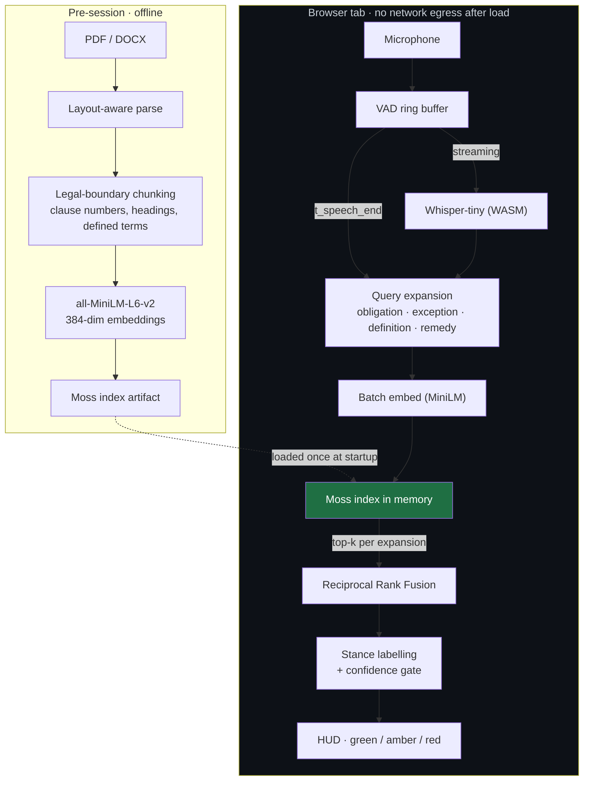

# KRONOS

**Local-first recall copilot for high-stakes contract negotiation.**
Speech → clause, in the browser tab, with no network egress and no vector database.

Built for **YC Fall 2026 × Moss: The Zero Latency Builder Sprint**
Themes: *Local-First AI & The Small Cloud* (primary) · *Real-Time Voice* · *Agent Reliability*

> **Status:** pre-implementation. Documentation is complete; code begins with the Day-0
> validation spikes. Numbers below marked `[TARGET]` are goals, not results. They will be
> replaced with `[MEASURED]` values and the hardware they came from, or removed.

---

## What it does

In a negotiation, someone makes a claim about the agreement:

> *"Your Q3 churn violates the minimums in the term sheet."*

You have read that document. You know there is a carve-out. Finding it takes forty seconds of
scrolling, and scrolling in front of the other side tells them you're not sure.

KRONOS listens to your own meeting, recognises the end of the sentence, and puts the governing
clauses on a heads-up panel — quoted verbatim from **your** documents, tagged with whether each
one helps you or hurts you:

```
┌─ SUPPORTS YOU ──────────────────── Term_Sheet_v4.pdf · §4.2.1(b) ─┐
│ "Notwithstanding §4.2, Q3 churn shall be exempt from the minimum  │
│  thresholds provided that annual revenue exceeds $50,000,000."    │
└───────────────────────────────── conf 0.89 · 212 ms · Moss 4.1 ms ┘

┌─ CUTS AGAINST YOU ──────────────── Term_Sheet_v4.pdf · §4.2 ──────┐
│ "Quarterly churn shall not exceed 4.0% of ending ARR."            │
└───────────────────────────────── conf 0.81 ─────────────────────── ┘
```

Every stage — voice detection, speech recognition, embedding, retrieval — runs inside the tab.
**After the page loads, KRONOS makes no network requests.**

---

## Why this needs Moss

Moss is not a checkbox here; remove it and the product does not exist.

The entire value proposition is *"deal documents never leave the machine."* That forces
retrieval into the browser, which rules out a hosted vector database — the moment you call
Pinecone or Weaviate, you have shipped the client's confidential corpus to a third party and
the CISO conversation is over.

So the requirement is: **semantic search over a contract corpus, in-tab, with no server,
fast enough to be invisible inside a conversational turn.** Moss's sub-10ms in-memory
retrieval is what makes the no-egress guarantee compatible with sub-second response. It is the
component that turns a compliance constraint into a latency advantage instead of a tax.

Retrieval is also the one stage with **zero** slack in the budget. ASR is hundreds of
milliseconds and embedding is tens. If retrieval cost 200–400ms — a normal round trip to a
hosted index — the perceived pause crosses the threshold where a human notices you waiting on
a machine, and the product stops working *socially* even though it still works technically.

---

## Architecture



**Measured interval:** `t_paint − t_speech_end` — from the moment voice-activity detection
declares the sentence finished, to the moment the clause is painted.

---

## Performance

| Stage | p50 | p95 |
|---|---|---|
| ASR final flush (tail only) | `[TARGET]` 120 ms | `[TARGET]` 300 ms |
| Query build + expansion | `[TARGET]` 5 ms | `[TARGET]` 15 ms |
| Embed (4 expansions, batched) | `[TARGET]` 25 ms | `[TARGET]` 60 ms |
| **Moss retrieval** | `[TARGET]` **< 10 ms** | `[TARGET]` **< 10 ms** |
| Rerank + stance | `[TARGET]` 10 ms | `[TARGET]` 25 ms |
| Render → paint | `[TARGET]` 30 ms | `[TARGET]` 60 ms |
| **End-of-utterance → painted** | `[TARGET]` **~200 ms** | `[TARGET]` **~470 ms** |

**Cold start** (model download + index hydration) is measured in **seconds, not milliseconds**,
and is disclosed separately rather than hidden. See [SPEC.md](./SPEC.md) §12.

### On the number we are not claiming

An earlier draft of this project advertised "~450ms end-to-end" while also specifying a
4–6 second audio capture window. Those cannot both be true — measured from the moment the
other person starts talking, that design takes five seconds or more, because the capture
window dominates every other term.

KRONOS streams transcription during speech instead of buffering, and reports the interval a
user actually experiences as waiting: **end of utterance → clause on screen**, as p50 and p95,
on named hardware. The timer shown in the demo video measures that interval and says so
on screen.

---

## Retrieval quality

Naive semantic search fails this problem in a specific and demo-killing way. Embedding the
assertion *"your churn violates the minimums"* and taking nearest neighbours returns clauses
**about churn minimums** — with the obligation clause being used against you as the likely top
hit, and the carve-out that saves you buried below it. Similarity to a claim does not retrieve
that claim's rebuttal.

KRONOS expands each assertion into several hypothetical clause forms (obligation, exception,
definition, remedy), embeds them as a batch, retrieves top-k for each from Moss, fuses with
Reciprocal Rank Fusion, then labels each surviving candidate's stance using legal structural
cues (`notwithstanding`, `except`, `provided that`, `shall not apply`) and cross-reference
resolution.

Showing the clause that *hurts* you, clearly labelled, is deliberate. Getting ambushed by §4.2
is worse than seeing it coming.

Full design in [SPEC.md](./SPEC.md) §7.

---

## Reliability

Whisper-tiny on poor far-field audio does not fail quietly — it **fabricates fluent
sentences**. That is the real risk to a "zero hallucinations" claim, and it lives at the input
layer, before retrieval ever runs.

KRONOS combines ASR confidence, input SNR, and the Moss rank-1/rank-2 similarity margin into a
single gate with three states:

| State | Meaning | Behaviour |
|---|---|---|
| 🟢 **Green** | Confident match | Clause card with stance label and verbatim text |
| 🟠 **Amber** | Weak match or narrow margin | "No confident match — closest §X.Y," collapsed, with the recognised text shown |
| 🔴 **Red** | ASR below floor / no speech | "Didn't catch that." Retrieval is not attempted |

The recognised transcript is always visible in small type, so you can instantly tell
*"it misheard me"* apart from *"my documents don't cover this."*

Thresholds are calibrated on the eval set and committed with the run that produced them —
not hand-tuned to make a demo look good.

---

## Privacy: the precise claim

**What is true:**

- No network requests after initial asset load. Shown unedited in the DevTools network panel.
- No writes to `localStorage`, `sessionStorage`, `IndexedDB`, the Cache API, or disk.
  Enforced by an automated test.
- Audio lives in a rolling ring buffer and is discarded after transcription. There is no
  recording feature and there will not be one.
- Closing the tab releases everything.

**What is not true, and which we will not claim:**

- WebAssembly linear memory is **not** a security enclave. It is an ordinary `ArrayBuffer`,
  readable from the console and from DevTools memory snapshots. It is not attested and does
  not defend against a malicious extension, a compromised browser, or physical access to an
  unlocked machine.
- "Data evaporates instantly on tab close" is a nice sentence and not a guarantee anyone can
  make about process memory. We don't make it.

WebAuthn-derived keys and AES-256-GCM encrypted provisioning are **roadmap, not built.**
See [PRD.md](./PRD.md) §9.

---

## Consent and intended use

KRONOS is a copilot for **your own side**, retrieving from **documents you already own**, in a
meeting you are **a party to**.

- The listener is never hidden: a persistent microphone indicator is always visible while armed.
- Nothing is recorded, stored, or retained.
- Recording and disclosure law varies by jurisdiction, and several US states require the
  consent of **all** parties. Complying with the law that applies to your meeting is your
  responsibility.

The discreet trigger exists so you don't have to **look down**, not so anyone is kept in the
dark. An earlier draft of this project used adversarial framing ("stealth," "the opponent never
knows"); that framing was wrong, was a legal liability, and has been removed. The UX insight
survives intact — see [PRD.md](./PRD.md) §2.

---

## Repository layout

```
kronos/
├── README.md              # this file
├── PRD.md                 # product requirements, scope, risks, plan
├── SPEC.md                # exhaustive technical specification
├── CHANGELOG.md           # timestamped log of every change
├── apps/web/              # Next.js app — the session HUD
├── packages/ingest/       # parse → legal-boundary chunk → embed → index
├── packages/retrieval/    # query expansion, Moss adapter, RRF, stance labelling
├── packages/audio/        # VAD, ring buffer, Whisper WASM worker
├── eval/                  # eval harness, labelled assertion set, charts
└── docs/                  # architecture diagram, judge Q&A prep
```

---

## Getting started

> Not yet implemented — these are the intended entry points, recorded here so the interface is
> fixed before the code is written.

```bash
pnpm install

# Ingest a contract into a Moss index artifact
pnpm ingest --in ./samples/term_sheet.pdf --out ./public/index/term_sheet.moss

# Verify the chunker did not mangle anything (do this before every demo)
pnpm dev  # then open /inspect

# Run the session HUD
pnpm dev  # then open /            (add ?debug=1 for the per-stage timing overlay)

# Reproduce the performance and recall numbers
pnpm eval
```

---

## Evaluation

`pnpm eval` runs 50 labelled assertion → clause pairs, including a **15-item adversarial
subset** chosen specifically because naive single-query similarity retrieves the wrong clause
on them, and reports:

- recall@1 / @3 / @5 and MRR, for KRONOS and for the naive baseline, on the same data
- end-of-utterance → paint latency, p50 / p95, with hardware named
- per-stage timing breakdown, including Moss in isolation
- false-confident rate — how often the green state appears while rank-1 is wrong
- ASR word error rate on the assertion set

Results and charts land in `eval/results/` and are committed with the hardware they came from.

---

## Scope: built vs. roadmap

**Built for this submission:** legal-boundary chunking · in-browser streaming ASR · in-browser
embedding · Moss retrieval with query expansion and rank fusion · stance labelling ·
confidence gating · zero-egress session · eval harness · demo mode.

**Roadmap, deliberately not built:** WebAuthn + AES-256-GCM enterprise provisioning · OPFS
encrypted caching · speaker diarisation · OCR for scanned documents · cross-encoder reranking ·
native desktop shell · multi-document conflict detection.

Five days is five days. The cut list and the reasoning behind each cut are in
[PRD.md](./PRD.md) §12.

---

## Documents

| Document | Contents |
|---|---|
| [PRD.md](./PRD.md) | Problem, users, consent posture, latency budget, requirements, risks, plan |
| [SPEC.md](./SPEC.md) | Every implementation detail: parameters, schemas, algorithms, tests, judge Q&A |
| [BUILD_PLAN.md](./BUILD_PLAN.md) | Phase-ordered construction sequence with exit criteria — no calendar |
| [HLD.md](./HLD.md) | System architecture, service decomposition, data architecture, ADRs |
| [LLD.md](./LLD.md) | Classes, database schema, binary formats, API contracts, algorithms |
| [CHANGELOG.md](./CHANGELOG.md) | Timestamped record of every change |
