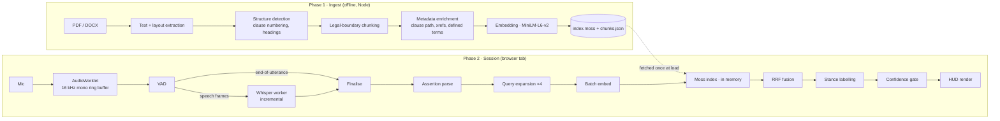

# KRONOS — Technical Specification

Exhaustive implementation reference. Every parameter, schema, algorithm, threshold, test, and
decision. If something is undecided, it is marked **`[OPEN]`**. If a number is unmeasured, it
is marked **`[TARGET]`**. Nothing in this document is stated with more confidence than we have.

| Field | Value |
|---|---|
| Version | 1.0 |
| Created | 2026-09-15 14:22 IST |
| Companion docs | [PRD.md](./PRD.md), [README.md](./README.md), [CHANGELOG.md](./CHANGELOG.md) |
| Time to deadline at authoring | 5 days, 9 hours |

---

## Table of contents

1. [System overview](#1-system-overview)
2. [Technology decisions](#2-technology-decisions)
3. [Repository structure](#3-repository-structure)
4. [Data model](#4-data-model)
5. [Ingest pipeline](#5-ingest-pipeline)
6. [Audio pipeline](#6-audio-pipeline)
7. [Retrieval pipeline](#7-retrieval-pipeline)
8. [Confidence gating](#8-confidence-gating)
9. [HUD and interaction](#9-hud-and-interaction)
10. [Moss integration](#10-moss-integration)
11. [Instrumentation](#11-instrumentation)
12. [Cold start](#12-cold-start)
13. [Security implementation](#13-security-implementation)
14. [Evaluation harness](#14-evaluation-harness)
15. [Test plan](#15-test-plan)
16. [Deployment](#16-deployment)
17. [Day-0 validation spikes](#17-day-0-validation-spikes)
18. [Hour-by-hour build plan](#18-hour-by-hour-build-plan)
19. [Demo operations](#19-demo-operations)
20. [Judge Q&A preparation](#20-judge-qa-preparation)
21. [Failure playbook](#21-failure-playbook)
22. [Open questions](#22-open-questions)

---

## 1. System overview

### 1.1 Two phases

KRONOS has a clean split between an **offline ingest phase** (runs on the Preparer's machine,
minutes, may use heavyweight tooling) and an **online session phase** (runs in the Principal's
browser tab, milliseconds, no network).



### 1.2 Threading model

Main thread does rendering only. Everything expensive is off it, because a 200ms jank on the
main thread is indistinguishable from 200ms of latency to the user.

| Context | Responsibility | Why |
|---|---|---|
| **Main thread** | React render, hotkey listener, HUD paint | Must stay responsive |
| **AudioWorklet** | 16 kHz capture, ring buffer, frame energy | Realtime audio thread; must never allocate |
| **Worker: `vad.worker`** | Voice activity detection over frames | Small, steady CPU |
| **Worker: `asr.worker`** | Whisper WASM, incremental decode | Heaviest consumer; isolated |
| **Worker: `retrieval.worker`** | MiniLM embedding + Moss + RRF + stance | Keeps the hot path off main |

Transfers use `postMessage` with transferable `ArrayBuffer`s — no structured-clone copies of
audio buffers on the hot path.

---

## 2. Technology decisions

| Layer | Choice | Rationale | Fallback |
|---|---|---|---|
| App shell | Next.js 14 (App Router), TypeScript | Hackathon requires a deployed link; Vercel deploy is trivial | Vite SPA if Next's SSR fights WASM |
| Styling | Tailwind CSS | Speed | — |
| ASR | `whisper-tiny.en`, quantised, via `whisper.cpp` WASM or `transformers.js` | English-only is smaller and more accurate than multilingual for the same size | Web Speech API comparison spike; larger quant if latency allows |
| VAD | Silero VAD (ONNX, WASM) | Far more robust than energy thresholding in a room with HVAC noise | Energy + zero-crossing fallback |
| Embeddings | `all-MiniLM-L6-v2`, 384-dim, quantised | Small, fast, well-understood; same model offline and online — **non-negotiable that both sides match** | `bge-small-en-v1.5` if recall is poor |
| Retrieval | **Moss** | Sub-10ms in-memory, no vector DB, runs in the tab | None — it's the point of the event |
| Runtime | `onnxruntime-web` (WASM + SIMD + threads) | Mature, good WASM SIMD support | — |
| PDF parse | `unstructured` (Python) or `pdfplumber` | Layout awareness for clause detection | `pdf.js` text layer |
| Monorepo | pnpm workspaces | — | — |

> [!WARNING]
> **The embedding model used at ingest and the one used in the session must be byte-identical,
> including quantisation.** A mismatch produces a silently broken index: retrieval returns
> plausible-looking but wrong results, and it is extremely hard to notice in a demo. The index
> artifact records a model fingerprint and the session refuses to load a mismatched index.

---

## 3. Repository structure

```
kronos/
├── README.md
├── PRD.md
├── SPEC.md
├── CHANGELOG.md
├── package.json
├── pnpm-workspace.yaml
│
├── apps/web/
│   ├── app/
│   │   ├── page.tsx                  # session HUD
│   │   ├── inspect/page.tsx          # chunk inspector
│   │   └── layout.tsx
│   ├── components/
│   │   ├── Hud.tsx                   # card stack, states
│   │   ├── ClauseCard.tsx            # stance-labelled clause
│   │   ├── MicIndicator.tsx          # always-visible listening state (CR-2)
│   │   ├── TranscriptStrip.tsx       # recognised text, small type (R-8)
│   │   └── DebugOverlay.tsx          # per-stage timings, ?debug=1
│   ├── lib/
│   │   ├── hotkey.ts                 # double-tap detector
│   │   ├── session.ts                # state machine
│   │   └── perf.ts                   # timing marks
│   └── public/
│       ├── models/                   # quantised model assets
│       ├── index/                    # prebuilt Moss index artifacts
│       └── demo/                     # bundled demo audio
│
├── packages/audio/
│   ├── capture.worklet.ts            # AudioWorklet, ring buffer
│   ├── vad.worker.ts                 # Silero VAD
│   ├── asr.worker.ts                 # Whisper WASM
│   └── types.ts
│
├── packages/ingest/
│   ├── parse.ts                      # PDF/DOCX → structured text
│   ├── chunk.ts                      # legal-boundary chunking
│   ├── enrich.ts                     # clause paths, xrefs, defined terms
│   ├── embed.ts                      # MiniLM, batch
│   ├── build-index.ts                # → Moss artifact
│   └── cli.ts
│
├── packages/retrieval/
│   ├── moss-adapter.ts               # thin interface over Moss — swappable
│   ├── expand.ts                     # assertion → 4 hypothetical clause forms
│   ├── fuse.ts                       # reciprocal rank fusion
│   ├── stance.ts                     # supports / against / context
│   ├── confidence.ts                 # composite gate
│   └── pipeline.ts                   # orchestration + timing
│
├── eval/
│   ├── dataset/
│   │   ├── assertions.jsonl          # 50 labelled pairs
│   │   ├── adversarial.jsonl         # the 15 hard ones
│   │   └── audio/                    # recorded far-field clips
│   ├── run-recall.ts
│   ├── run-latency.ts
│   ├── run-baseline.ts               # naive single-query comparison
│   └── results/                      # committed, hardware-stamped
│
└── docs/
    ├── architecture.mmd
    ├── judge-qa.md
    └── demo-runbook.md
```

---

## 4. Data model

### 4.1 Chunk

The central object. Everything about retrieval quality flows from getting this right.

```typescript
interface Chunk {
  id: string;                    // "term_sheet_v4::4.2.1::b"
  docId: string;                 // "term_sheet_v4"
  docTitle: string;              // "Term Sheet v4"

  // Structural identity
  clausePath: string[];          // ["4", "2", "1", "b"]
  clauseLabel: string;           // "§4.2.1(b)"
  headingTrail: string[];        // ["ARTICLE IV — COVENANTS", "Churn Minimums"]
  pageStart: number;
  pageEnd: number;

  // Content
  text: string;                  // verbatim, complete logical unit
  charCount: number;
  tokenCount: number;

  // Enrichment
  crossRefs: string[];           // ["4.2"] — clauses this one cites
  definedTerms: string[];        // ["Churn", "ARR"]
  structuralSignals: {
    hasExceptionMarker: boolean; // notwithstanding / except / provided that / unless
    hasObligationMarker: boolean;// shall / must / no less than
    hasDefinitionMarker: boolean;// "means" / "shall mean"
    hasRemedyMarker: boolean;    // "remedy" / "cure" / "in the event"
  };

  // Vector
  embedding: Float32Array;       // 384-dim, L2-normalised
  embeddingModel: string;        // "all-MiniLM-L6-v2-q8" — must match at query time
}
```

### 4.2 Index artifact

```typescript
interface IndexArtifact {
  version: 1;
  builtAt: string;               // ISO 8601
  modelFingerprint: string;      // sha256 of the embedding model file
  dimensions: 384;
  chunkCount: number;
  docs: { id: string; title: string; pageCount: number; sha256: string }[];
  chunks: Chunk[];               // embeddings stored as a packed Float32Array block
}
```

Session startup asserts `modelFingerprint` matches the loaded embedding model, and refuses to
run otherwise. See the warning in §2.

### 4.3 Retrieval result

```typescript
interface RetrievalResult {
  chunk: Chunk;
  scores: {
    fused: number;               // RRF score
    perExpansion: Record<ExpansionKind, number | null>;
    rank1Margin: number;         // gap to the next result — drives confidence
  };
  stance: "supports" | "against" | "context";
  stanceConfidence: number;
  stanceReasons: string[];       // e.g. ["exception marker: 'notwithstanding'", "xref → §4.2"]
}
```

### 4.4 Timing record

Emitted for every query, rendered by the debug overlay, aggregated by the eval harness.

```typescript
interface QueryTiming {
  queryId: string;
  tSpeechEnd: number;            // performance.now() origin for the reported metric
  tAsrDone: number;
  tQueryBuilt: number;
  tEmbedDone: number;
  tMossDone: number;             // the sponsor-critical delta
  tRanked: number;
  tPaint: number;                // measured in rAF after commit
  totalFromSpeechEnd: number;    // tPaint - tSpeechEnd — THE number
  audioMs: number;               // utterance length, for context
  expansionCount: number;
  candidateCount: number;
}
```

---

## 5. Ingest pipeline

### 5.1 Parse

1. Reject scanned/image PDFs early. Heuristic: extractable text characters per page < 100
   across > 30% of pages ⇒ raise `ScannedDocumentError` with a clear message. OCR is out of
   scope (PRD NG / F-6), and silently embedding garbage is worse than refusing.
2. Extract text with coordinates, font size, and font weight. These drive heading detection.
3. Normalise: collapse hyphenation across line breaks, unify quote characters, strip
   headers/footers that repeat on > 60% of pages, preserve paragraph breaks.

### 5.2 Structure detection

Detect clause numbering with an ordered set of patterns, most specific first:

| Pattern | Regex sketch | Example |
|---|---|---|
| Decimal multi-level | `^\s*(\d+(?:\.\d+)+)\s+` | `4.2.1 ` |
| Decimal top level | `^\s*(\d+)\.\s+[A-Z]` | `4. Covenants` |
| Alpha sub-clause | `^\s*\(([a-z])\)\s+` | `(b) ` |
| Roman sub-clause | `^\s*\(([ivxlc]+)\)\s+` | `(iv) ` |
| Article heading | `^\s*ARTICLE\s+([IVXLC]+)` | `ARTICLE IV` |
| Section heading | `^\s*SECTION\s+([\d.]+)` | `SECTION 4.2` |
| Defined-term block | `^\s*"([A-Z][\w\s]+)"\s+(means\|shall mean)` | `"Churn" means…` |

Font-size and boldness deltas corroborate heading detection where numbering is absent.

### 5.3 Legal-boundary chunking

**The rule: a chunk is always a complete logical unit. Never split mid-sentence. Never split on
a token count.**

```
Algorithm: chunkDocument(blocks)

  1. Build a clause tree from detected numbering + headings.
  2. Walk leaves. For each leaf clause:
       a. text = full clause text including its number
       b. if tokenCount < MIN_TOKENS (40):
            merge with the parent clause's lead-in, or with the adjacent sibling,
            whichever yields a coherent unit. Very short clauses like "(c) Reserved."
            are useless alone.
       c. if tokenCount > MAX_TOKENS (320):
            split ONLY at sub-clause boundaries, never mid-sentence.
            If there are no sub-clauses, split at paragraph breaks.
            If there is a single 400-token paragraph, keep it whole and flag it —
            a truncated clause is worse than a long one.
  3. Every chunk inherits its full headingTrail and clausePath.
  4. Defined-term blocks become their own chunks, always.
  5. Resolve cross-references: scan for §/Section citations, record in crossRefs.
```

Parameters:

| Constant | Value | Note |
|---|---|---|
| `MIN_TOKENS` | 40 | Below this, merge |
| `MAX_TOKENS` | 320 | Above this, split at structural boundaries only |
| `HARD_CEILING` | 512 | MiniLM's window; truncate for *embedding* only, never for display |
| `OVERLAP` | 0 | Structural chunking makes overlap unnecessary and harmful for verbatim display |

> [!IMPORTANT]
> The embedding may be computed on a truncated 512-token view, but the **displayed text is
> always the complete chunk.** The user must never read a clause that stops mid-sentence.

### 5.4 The chunk inspector

A page at `/inspect` renders every chunk as a card: clause label, heading trail, token count,
full text, and flags for anything that looks wrong (over `MAX_TOKENS`, no clause label,
suspiciously short, ends without terminal punctuation).

This costs perhaps ninety minutes and it is the single highest-leverage debugging tool in the
project. **Run it on the demo contract before every rehearsal and before recording the video.**

### 5.5 Embedding at ingest

Batch size 32. L2-normalise so cosine similarity reduces to a dot product. Record the model
file's sha256 as `modelFingerprint`.

---

## 6. Audio pipeline

### 6.1 Capture

| Parameter | Value | Note |
|---|---|---|
| Sample rate | 16,000 Hz mono | Whisper's native rate; resample in the worklet if the device differs |
| Frame size | 512 samples (32 ms) | Silero VAD's expected frame at 16 kHz |
| Ring buffer | 30 s | Bounded; overwrites. Never grows, never persists |
| `echoCancellation` | `false` | `[OPEN]` — test both. AEC can suppress a distant speaker |
| `noiseSuppression` | `true` | `[OPEN]` — browser NS may help or may smear speech; measure |
| `autoGainControl` | `true` | Helps with far-field level |

### 6.2 Voice activity detection

Silero VAD (ONNX, ~1.8 MB) per frame.

| Constant | Value | Purpose |
|---|---|---|
| `SPEECH_THRESHOLD` | 0.5 | Probability above which a frame is speech |
| `MIN_SPEECH_MS` | 250 | Ignore coughs and door clicks |
| `HANGOVER_MS` | 600 | Silence before declaring end-of-utterance. **This directly trades responsiveness against cutting people off mid-sentence.** Tune on real recordings; 600 is a starting point, not a result |
| `PRE_ROLL_MS` | 300 | Audio retained *before* speech onset, so the first word isn't clipped |
| `MAX_UTTERANCE_MS` | 15,000 | Force a flush; nobody's assertion needs more |

`t_speech_end` is the timestamp at which the hangover window expires — the origin for the
reported latency metric.

> The hangover is disclosed honestly in the video: the user waits `HANGOVER_MS` *plus* the
> pipeline latency. Hiding a 600ms constant inside a "200ms" claim is exactly the kind of
> accounting this project rejects.

### 6.3 Streaming ASR

The design that makes sub-second honest:

```
on speech onset:
    start incremental decode loop
every CHUNK_INTERVAL_MS (750 ms) while speech continues:
    decode the accumulated buffer, keep the hypothesis, discard it next round
on end-of-utterance (VAD hangover expires):
    final decode over [onset - PRE_ROLL, end]
    → but the bulk of the audio has already been processed and is warm in cache
```

The final flush therefore does far less work than a cold 5-second decode. This is the entire
reason the honest number can be a few hundred milliseconds rather than several seconds.

| Constant | Value |
|---|---|
| `CHUNK_INTERVAL_MS` | 750 |
| Model | `whisper-tiny.en`, quantised `[OPEN: q5_1 vs q8 — measure size/accuracy/latency]` |
| Threads | `navigator.hardwareConcurrency` capped at 4 |
| `temperature` | 0 — greedy, deterministic |
| `no_speech_threshold` | 0.6 — feeds the red state |
| `logprob_threshold` | −1.0 — feeds the confidence gate |
| `condition_on_previous_text` | `false` — **prevents runaway hallucination loops on poor audio** |
| `initial_prompt` | Domain vocabulary (below) |

### 6.4 Domain vocabulary biasing

Whisper-tiny mishears legal vocabulary badly. An `initial_prompt` seeded with the terms that
actually appear in the loaded corpus measurably improves recognition of exactly the words that
matter for retrieval:

> *"The following is a discussion of a term sheet: churn, ARR, indemnification, EBITDA,
> covenant, carve-out, escrow, liquidation preference, material adverse change, drag-along,
> tag-along, reps and warranties, minimum threshold, Section 4.2."*

Generate this automatically from the corpus's defined terms plus a fixed legal base list.

### 6.5 The far-field problem

**This is Risk #1 in the PRD.** A laptop microphone 4 feet away, in a hard-surfaced room,
capturing a person not facing it, produces the input condition where Whisper-tiny does not
degrade into "worse accuracy" — it degrades into **fluent fabrication**.

Mitigations, in order of preference:

1. Estimate SNR from VAD frame energy during speech vs. silence. Below a floor, go **red**
   rather than transcribing. Refusing is always better than inventing.
2. `condition_on_previous_text: false` to stop repetition loops.
3. Domain prompt biasing (§6.4).
4. If the Day-0 spike shows laptop-mic audio is unusable: **state a hardware assumption**
   (lapel or directional mic) in the PRD and demo with one. A stated requirement is honest
   engineering; pretending a laptop mic works is not.
5. Demo mode uses a bundled clip recorded under the conditions we claim.

---

## 7. Retrieval pipeline

### 7.1 Assertion parsing

Shallow, deterministic, microseconds. No LLM in the hot path.

```typescript
interface ParsedAssertion {
  subject: string[];      // ["churn", "Q3"]        — nouns, defined terms matched against corpus
  obligation: string[];   // ["minimums", "violates"] — obligation/breach language
  instrument: string[];   // ["term sheet"]          — which document is being invoked
  qualifiers: string[];   // ["Q3"]                  — temporal/conditional modifiers
  raw: string;
}
```

Implementation: match against the corpus's own defined-term list first (highest signal — these
are the words that exist in the documents), then a fixed obligation lexicon, then fall back to
the raw string.

### 7.2 Query expansion

Four hypothetical clause texts per assertion. HyDE in spirit, template-driven in practice, so
it costs microseconds and **cannot hallucinate**, because no model generates the text.

| Kind | Template | Targets |
|---|---|---|
| `obligation` | `"{subject} shall not exceed the {obligation} set forth herein."` | The clause being invoked against you |
| `exception` | `"Notwithstanding the foregoing, {subject} shall be exempt from {obligation} provided that the conditions herein are satisfied."` | **The carve-out that saves you** |
| `definition` | `"\"{subject}\" means, for purposes of this Agreement,"` | Definitional disputes |
| `remedy` | `"In the event that {subject} exceeds {obligation}, the sole remedy shall be"` | Consequences |

The `exception` expansion is the one that solves the core problem in PRD §7.1. Nearest
neighbours of an *assertion* are clauses that restate the obligation; nearest neighbours of a
*hypothetical exception* are actual exceptions.

All four are embedded in a **single batch** — one MiniLM forward pass over a batch of 4,
which is why the fan-out costs ~25ms rather than 4×.

### 7.3 Retrieval and fusion

```
for each expansion e:
    results[e] = moss.search(embed(e), k = 10)

fuse with Reciprocal Rank Fusion:
    RRF(d) = Σ_e  w_e / (K + rank_e(d))
    K = 60          (standard)
    w_obligation = 1.0
    w_exception  = 1.3      ← deliberately up-weighted; the carve-out is the high-value result
    w_definition = 0.8
    w_remedy     = 0.8

expand by cross-reference:
    for each of the top 5 fused results, pull any chunk it cites (crossRefs)
    into the candidate pool at a 0.7 score discount.
    Rationale: §4.2.1(b) says "notwithstanding §4.2" — the user needs both.

take top 3 for display
```

Weights are **`[OPEN]` until calibrated on the eval set.** Hand-tuning them to make one demo
sentence work is precisely the failure mode the eval harness exists to prevent.

### 7.4 Stance labelling

For each surviving candidate, decide whether it helps or hurts the operator.

```
score_supports = 0
score_against  = 0

# structural signals (precomputed at ingest)
if chunk.structuralSignals.hasExceptionMarker:   score_supports += 2.0
if chunk.structuralSignals.hasObligationMarker:  score_against  += 1.5
if chunk.structuralSignals.hasDefinitionMarker:  → "context"

# retrieval provenance — which expansion found it
if best-ranked via `exception` expansion:        score_supports += 1.5
if best-ranked via `obligation` expansion:       score_against  += 1.0

# cross-reference direction
if chunk cites a clause that is itself in the result set
   AND chunk has an exception marker:            score_supports += 1.0

# negation scope near the asserted subject
if the subject appears within a negated/exempted span: score_supports += 1.0

stance = argmax, with confidence = |score_supports - score_against| / (sum + ε)
if confidence < 0.25 → "context"
```

Every label carries `stanceReasons` — the specific signals that fired. These are shown on
hover. A label you cannot explain is a label a judge will not trust.

**`[OPEN]`**: whether a small cross-encoder rerank is needed, or whether these heuristics carry
it. Decided by the eval harness on Day 3, not by intuition.

---

## 8. Confidence gating

### 8.1 Composite score

```
C = w_asr · asr_conf
  + w_snr · snr_conf
  + w_sim · sim_conf
  + w_mgn · margin_conf

asr_conf    = sigmoid(mean_token_logprob, centre = -0.8)   ∈ [0,1]
snr_conf    = clamp((snr_db - 6) / 18, 0, 1)               6 dB → 0, 24 dB → 1
sim_conf    = clamp((top1_cosine - 0.30) / 0.45, 0, 1)
margin_conf = clamp((top1 - top2) / 0.15, 0, 1)            a narrow margin means "unsure"

w_asr = 0.30, w_snr = 0.15, w_sim = 0.35, w_mgn = 0.20     [OPEN — calibrate]
```

### 8.2 Thresholds and states

| State | Condition | Display |
|---|---|---|
| 🔴 Red | `no_speech_prob > 0.6` OR `asr_conf < 0.25` OR no VAD speech | "Didn't catch that." No retrieval attempted. |
| 🟠 Amber | `C < C_AMBER` | "No confident match — closest §X.Y," collapsed card, recognised text prominent |
| 🟢 Green | `C ≥ C_AMBER` | Full stance-labelled cards |

`C_AMBER = 0.55` **`[TARGET — to be calibrated]`**. The calibration objective is
**false-confident rate ≤ 5%**: green must almost never appear while rank-1 is wrong. When in
doubt, bias toward amber — a negotiator who reads out the wrong clause is worse off than one
who reads nothing.

The chosen threshold and the eval run that produced it are committed to `eval/results/`.

### 8.3 Always-visible transcript

Requirement R-8. The recognised text is rendered in small type under the cards, at all times,
in every state. This single element resolves the user's most urgent question in the moment:
*did it mishear me, or does my contract genuinely not cover this?* Those two failures demand
opposite reactions, and the user has about one second to tell them apart.

---

## 9. HUD and interaction

### 9.1 Trigger

Double-tap of a modifier key (default `Alt`/`Option`, configurable).

```typescript
const DOUBLE_TAP_WINDOW_MS = 400;   // two keydowns of the same modifier within this window
const MIN_TAP_GAP_MS = 60;          // debounce key repeat
```

Behaviour: first double-tap **arms** the listener. VAD then handles segmentation
automatically — no hold-to-talk, no release. A second double-tap disarms. `Esc` disarms
immediately and clears the HUD.

Why arm-and-forget rather than push-to-talk: holding a key through someone else's sentence is
visible, and the whole point is not looking like you're operating a machine.

### 9.2 Layout

Compact panel, bottom-right, ~420px wide. Deliberately not full-screen: the user is looking at
a person, not a dashboard, and the content is confidential in a room that may contain other people.

```
┌──────────────────────────────────────────────┐
│ ● LISTENING            [always visible]      │  ← MicIndicator, CR-2
├──────────────────────────────────────────────┤
│  SUPPORTS YOU      Term_Sheet_v4 · §4.2.1(b) │
│  "Notwithstanding §4.2, Q3 churn shall be    │
│   exempt from the minimum thresholds…"       │
│                      conf 0.89 · why? ⓘ      │
├──────────────────────────────────────────────┤
│  CUTS AGAINST YOU  Term_Sheet_v4 · §4.2      │
│  "Quarterly churn shall not exceed 4.0%…"    │
├──────────────────────────────────────────────┤
│ heard: "your Q3 churn violates the minimums" │  ← TranscriptStrip, R-8
│ 212 ms · Moss 4.1 ms                         │
└──────────────────────────────────────────────┘
```

Colour: green left border for supports, amber for against, grey for context. Never red for
"against" — red reads as *error*, and that clause is correct information the user needs.

### 9.3 Legibility

Someone reads this while maintaining a conversation. That constrains everything:

- Body text ≥ 16px, line-height 1.5, high contrast.
- The matched span within the clause is **bolded** so the eye lands in the right place.
- Maximum 3 cards. Never scroll — if it doesn't fit, it doesn't help.
- New results replace old ones with a 120ms crossfade. No spinners: a spinner is a request for
  attention the user cannot give.

### 9.4 Debug overlay (`?debug=1`)

Per-stage timing table, live, updating per query. Rolling p50/p95. Moss time highlighted. This
is what gets screen-recorded for the video — it is the proof, and it is far more persuasive
than any claim in the narration.

---

## 10. Moss integration

### 10.1 Adapter interface

All Moss usage goes through one thin interface. If the SDK surprises us on Day 0, exactly one
file changes.

```typescript
interface VectorIndex {
  load(artifact: ArrayBuffer): Promise<void>;
  search(query: Float32Array, k: number): Promise<SearchHit[]>;
  readonly size: number;
  readonly dimensions: number;
}

interface SearchHit {
  chunkId: string;
  score: number;       // cosine similarity
  elapsedMs: number;   // measured by the adapter if the SDK doesn't report it
}
```

### 10.2 Batch search

If Moss supports multi-query search natively, use it — one call for four expansions beats four
calls. If not, issue four sequential calls; at sub-10ms each the total is still comfortably
inside budget. **`[OPEN: resolve in the Day-0 spike.]`**

### 10.3 Timing honestly

Measure Moss with `performance.now()` immediately around the call, excluding embedding, and
report it as its own line item. Do not fold embedding time into "retrieval" — either
direction of that error is dishonest, and the sponsor will be reading this number closely.

### 10.4 What we will say about Moss

That it is load-bearing, not decorative:

- The privacy guarantee forces retrieval in-tab, which rules out any hosted vector DB.
- Retrieval is the one stage with zero slack — ASR eats hundreds of milliseconds, embedding
  eats tens, and what remains before a human perceives a pause is small.
- A hosted index at 200–400ms round trip would push the total past the point where the
  interaction stops feeling like recall and starts feeling like waiting on a computer.
- Moss converts a compliance constraint into a latency advantage rather than a tax.

---

## 11. Instrumentation

### 11.1 Marks

`performance.mark()` at each boundary; `performance.measure()` for each stage. `t_paint` is
captured in a `requestAnimationFrame` callback scheduled after React commits — the earliest
honest approximation of "the user can see it."

### 11.2 Reporting rules

Codified so they can't drift under demo pressure:

1. Report **p50 and p95** together. Never a lone number.
2. Always name hardware, OS, and browser version.
3. Never report a mean — one slow GC pause makes a mean meaningless.
4. n ≥ 30 for any reported percentile.
5. Every number carries its **definition** (which two marks it spans).
6. Cold start is reported **separately** and never folded into query latency.
7. If a number is a target rather than a measurement, it is labelled as such everywhere it
   appears — README, PRD, slides, video.

---

## 12. Cold start

### 12.1 The real constraint

The corpus is not the memory problem. A 20-page contract yields roughly 200 chunks; at 384
dimensions × 4 bytes that is about **300 KB** of vectors. Even a 10,000-page data room is on
the order of 150 MB. The WASM linear-memory ceiling is nowhere near being the binding
constraint, and claiming otherwise invites a judge to do the arithmetic and conclude we don't
understand our own system.

The actual cost is **model download and initialisation**:

| Asset | Approx. size | Note |
|---|---|---|
| `whisper-tiny.en` quantised | 30–75 MB | `[OPEN]` — depends on quantisation, measure |
| `all-MiniLM-L6-v2` quantised | ~23 MB | |
| Silero VAD | ~1.8 MB | |
| `onnxruntime-web` WASM | ~10 MB | |
| Index artifact (demo corpus) | < 1 MB | Negligible, as computed above |

### 12.2 Mitigations

1. Long-lived `Cache-Control` on model assets; a returning visitor pays nothing.
2. Parallel fetch with a **byte-accurate** progress bar. "Loading 14.2 / 58.0 MB" builds
   trust; an indeterminate spinner destroys it.
3. Lazy-load Whisper **after** MiniLM and the index, so the app becomes partially interactive
   sooner.
4. **Demo mode is available the instant the page is interactive**, because a judge on a
   conference-room connection will not wait.
5. Warm the WASM runtime with a dummy inference during load, so the first real query doesn't
   pay JIT cost — otherwise the first query is 5× slower than every subsequent one and it will
   be the one the judge sees.

### 12.3 Demo mode

Requirement F-14. A bundled audio clip is fed through the **identical** pipeline — same VAD,
same ASR, same embedding, same Moss, same HUD. Not a mock, not a recorded video, not hardcoded
results. The only substitution is the audio source.

This exists because the deployed link will be opened by a stranger, on unknown hardware, in a
noisy room, with no microphone permission granted and no documents loaded. Demo mode is
labelled on screen as replayed audio. Honest, and it works.

---

## 13. Security implementation

### 13.1 Enforcing zero egress

- Strict CSP: `connect-src 'self'` and no third-party origins. Nothing can phone home.
- No analytics, no telemetry, no error reporting SDK, no fonts from a CDN. Bundle everything.
- All model and index assets are same-origin and fetched during load only.
- An automated test (§15) records the network log across a full session and **asserts zero
  requests after the load phase completes.**

### 13.2 Enforcing no persistence

- Zero use of `localStorage`, `sessionStorage`, `IndexedDB`, the Cache API from app code, or
  OPFS. (Browser-level HTTP caching of static model assets is permitted and disclosed — those
  assets are public model weights, not deal content.)
- Automated test asserts all storage buckets are empty after a full session.
- Audio lives in a preallocated ring buffer that never grows and is overwritten continuously.
- Transcripts are held in a bounded array capped at the last N utterances, in memory only.

### 13.3 What we do not claim

Repeated here because it is the highest-risk sentence in the whole submission:

> WebAssembly linear memory is an ordinary `ArrayBuffer` in the host JavaScript realm. It is
> readable from the console and from DevTools heap snapshots. **It is not an enclave, it is
> not attested, and it provides no protection against a malicious extension, a compromised
> browser, or physical access to an unlocked machine.**

We state this in the README, the PRD, and the video. The true claim — no egress, no
persistence — is already a materially better posture than any cloud alternative, and it has
the advantage of surviving a follow-up question.

---

## 14. Evaluation harness

### 14.1 Dataset

`eval/dataset/assertions.jsonl`, 50 entries:

```jsonc
{
  "id": "a017",
  "assertion": "Your Q3 churn violates the minimums in the term sheet.",
  "goldChunkIds": ["term_sheet_v4::4.2.1::b"],
  "acceptableChunkIds": ["term_sheet_v4::4.2"],
  "expectedStance": "supports",
  "adversarial": true,
  "note": "Naive single-query similarity ranks §4.2 (the obligation) first; the carve-out at §4.2.1(b) is the useful result."
}
```

15 of the 50 are flagged `adversarial: true` — chosen **specifically** because naive
single-query similarity retrieves the wrong clause. Reporting performance only on easy
examples is self-deception.

### 14.2 Runs

| Script | Reports |
|---|---|
| `run-recall.ts` | recall@1/3/5, MRR — overall and on the adversarial subset |
| `run-baseline.ts` | Same metrics for naive single-query search, same data, same index |
| `run-latency.ts` | Per-stage p50/p95 over ≥30 runs; end-of-utterance → paint; Moss isolated |
| `run-asr.ts` | WER on the recorded far-field clips; correlation between ASR confidence and retrieval correctness |
| `calibrate.ts` | Sweeps `C_AMBER` and RRF weights; picks the setting meeting false-confident ≤ 5% at maximum recall |

### 14.3 Outputs

Committed to `eval/results/` with a hardware stamp:

- `latency.svg` — per-stage stacked bars, p50 and p95, Moss highlighted
- `recall.svg` — KRONOS vs. baseline, overall and adversarial, side by side
- `calibration.json` — the chosen thresholds and the run that justified them
- `RESULTS.md` — the table that goes in the README and on screen in the video

> [!TIP]
> Nearly every other submission will present a demo. Very few will present a calibration sweep
> and a baseline comparison on the same data. The recall-vs-baseline chart is the cheapest
> credibility available, and the lift it shows is real engineering work you did — the query
> expansion in §7.2 — not a chart for its own sake.

---

## 15. Test plan

| # | Test | Type | Asserts |
|---|---|---|---|
| T-1 | Chunker on the demo contract | Golden | Chunk count, no mid-sentence splits, every chunk has a clause label |
| T-2 | Chunker on a malformed PDF | Unit | Raises `ScannedDocumentError`, never emits garbage |
| T-3 | Model fingerprint mismatch | Unit | Session refuses to load the index |
| T-4 | VAD segmentation on recorded clips | Golden | Utterance boundaries within ±150 ms of hand-labelled |
| T-5 | Query expansion determinism | Unit | Same assertion → identical 4 expansions |
| T-6 | RRF correctness | Unit | Known rank inputs → known fused order |
| T-7 | Stance labelling | Golden | 20 hand-labelled clauses, ≥ 85% agreement |
| T-8 | **Zero egress** | Integration | Network log empty after load phase |
| T-9 | **Zero persistence** | Integration | All storage buckets empty after a session |
| T-10 | Amber path | Integration | Deliberately garbled audio → amber, never a green wrong answer |
| T-11 | Red path | Integration | Silence / noise → red, no retrieval attempted |
| T-12 | Cold start on a clean profile | Manual | Time to interactive recorded and disclosed |
| T-13 | Demo mode with no mic permission | Integration | Full pipeline runs end to end |
| T-14 | Latency regression | CI | p95 does not exceed the committed budget |

T-8 and T-9 are the CISO's entire question, answered by a machine rather than by an adjective.

---

## 16. Deployment

- **Vercel**, static export where possible. Required headers for WASM threads:
  - `Cross-Origin-Opener-Policy: same-origin`
  - `Cross-Origin-Embedder-Policy: require-corp`
  
  These are mandatory for `SharedArrayBuffer`, which multi-threaded WASM needs. They also
  break any cross-origin asset — which is fine, because we bundle everything anyway (§13.1).
  Verify this on Day 4, not Day 5: COOP/COEP problems are a classic last-night disaster.
- Model assets served same-origin with long-lived cache headers.
- The deployed link must work **on a clean profile, in an incognito window, with no
  microphone permission.** That is the state a judge will open it in. Test exactly that.

---

## 17. Day-0 validation spikes

Three experiments, roughly two hours total, **before any product code is written.** Each one
can invalidate the architecture, and discovering that on Day 4 is fatal while discovering it on
Day 0 is merely inconvenient.

### Spike A — Moss in the browser *(45 min)*

Load a 200-vector, 384-dim index in a blank page. Run 100 queries. Record p50/p95. Confirm:
does the SDK run in a Web Worker? Does it expose timing? Does it support batch query?

**Pass:** sub-10ms p95 in-tab.
**Fail:** raise immediately — this is the sponsor requirement and the whole architecture.

### Spike B — Far-field Whisper-tiny *(45 min)* ← **the one that matters**

Record yourself saying the demo assertion from **4 feet away, off-axis, in a hard-surfaced
room, at normal conversational volume.** Run it through `whisper-tiny.en` in the browser.

**Pass:** the domain words — "churn," "minimums," "term sheet" — come through.
**Partial:** garbled but improved by the domain prompt (§6.4) ⇒ keep, lean on confidence gating.
**Fail:** fabricated fluent nonsense ⇒ **change the architecture today.** Options: state a
lapel/directional mic requirement, move up a model size if latency permits, or compare the Web
Speech API. Do not proceed to build the UI on top of an input layer that doesn't work.

### Spike C — MiniLM in the browser *(30 min)*

Embed a batch of 4 short strings. Record p50/p95 and cold-start cost. Verify browser output
matches Node output for the same input to within floating-point tolerance — this is the §2
fingerprint problem, and catching it here saves a day of inexplicably bad retrieval later.

---

## 18. Hour-by-hour build plan

Authoring time: 2026-09-15 14:22 IST. Deadline 2026-09-20 23:59 IST. Internal target
**2026-09-20 20:00 IST**, preserving four hours of buffer.

### Day 0 — Sep 15, afternoon/evening
| Block | Work |
|---|---|
| +0:00 | Repo scaffold, pnpm workspaces, Next.js skeleton |
| +1:00 | **Spike A** — Moss in browser |
| +2:00 | **Spike B** — far-field Whisper |
| +3:00 | **Spike C** — MiniLM in browser |
| +4:00 | **Decision gate.** Record spike results in CHANGELOG. Revise architecture if B failed. |
| +5:00 | Select and prepare the demo contract (public-domain or synthetic — never a real confidential agreement in a public repo) |

### Day 1 — Sep 16 · Ingest
Parse → structure detection → legal-boundary chunking → enrichment → embedding → Moss artifact.
Build `/inspect`. **Gate: chunks on the demo contract are clean, complete, and correctly labelled.**

### Day 2 — Sep 17 · Live loop
AudioWorklet + ring buffer → Silero VAD → streaming Whisper worker → single-query embed → Moss
→ minimal HUD. Instrumentation from the first line of code, not retrofitted.
**Gate: one live spoken sentence produces a real clause, with a real timing breakdown.**

### Day 3 — Sep 18 · Quality
Query expansion, RRF, cross-reference expansion, stance labelling, confidence gating,
amber/red states, HUD polish, transcript strip, debug overlay.
**Gate: the adversarial assertion retrieves the carve-out, not the obligation.**

### Day 4 — Sep 19 · Proof and ship
Eval dataset (50 pairs, 15 adversarial), all eval scripts, calibration sweep, charts, T-8/T-9
egress and persistence tests, cold-start work, demo mode, **deploy and verify on a clean
profile.** **Gate: a stranger's laptop can open the URL and see it work.**

### Day 5 — Sep 20 · Submit
Morning: architecture diagram, docs final, rehearse the demo five times, judge Q&A prep.
Afternoon: record and cut the video. **Submit by 20:00 IST.**

> [!CAUTION]
> Anything not finished by Day 4 evening is cut, not crammed. A working smaller product with
> honest numbers beats a broken larger one, and the deployed-link requirement means a judge
> will find the broken parts without you there to explain them.

---

## 19. Demo operations

### 19.1 Pre-demo checklist

1. Run `/inspect` on the demo corpus — confirm no mangled chunks.
2. Warm the browser cache; confirm cold start on the actual demo machine.
3. Confirm microphone selection and input level; run three test utterances.
4. Confirm demo mode works with the microphone disabled.
5. Open DevTools network panel, clear it, confirm zero requests during a live query.
6. Enable `?debug=1`.

### 19.2 Video shot list

| # | Shot | Purpose |
|---|---|---|
| 1 | Two people, an assertion is made, someone scrolls a PDF while the room waits | Establish the problem in silence |
| 2 | Same assertion, discreet trigger, cut to screen | The product |
| 3 | Close-up: timer **labelled** "end of utterance → clause on screen" | The honest number |
| 4 | Close-up: clause card with stance labels | The differentiator |
| 5 | DevTools network panel, unedited, zero requests | The CISO answer |
| 6 | Debug overlay, Moss line at single-digit ms | The sponsor answer |
| 7 | A deliberately induced amber state | Reliability — the system declines to guess |
| 8 | `eval/results/recall.svg` — KRONOS vs. baseline | The engineering answer |
| 9 | Spoken scope statement: what's built, what's roadmap | Credibility |

### 19.3 Video prohibitions

- No unlabelled timers.
- No edited network panel.
- No hardcoded results presented as live.
- No security claim beyond §13.3.
- No latency number without p50/p95 and named hardware.

---

## 20. Judge Q&A preparation

Rehearse these aloud. The answer is not just the content — it's answering without hesitating.

**"Your latency number — measured from when?"**
From VAD end-of-utterance to painted frame. We stream transcription during speech, so the final
flush only processes the tail. Cold start and the 600ms VAD hangover are disclosed separately;
we don't hide constants inside the headline number. p50 X, p95 Y, on [hardware].

**"Why not just use a hosted vector database?"**
It would void the entire proposition. The moment the corpus leaves the machine we've shipped
confidential deal documents to a third party, and there's no CISO conversation after that.
Retrieval must happen in the tab, which is exactly the problem Moss solves — and at 200–400ms
of round trip, a hosted index would also push us past the point where the pause is perceptible.

**"Isn't WASM memory readable from DevTools?"**
Yes. It's an ordinary `ArrayBuffer` and it is not a security boundary. We don't claim it is.
What we claim is zero egress and zero persistence, and both are asserted by automated tests.
Enclave-grade protection is roadmap and would need hardware attestation.

**"If similarity search returns the clause about churn minimums, doesn't it return the clause
being used against me?"**
Exactly right, and that's the core problem. We expand each assertion into four hypothetical
clause forms — including an explicit exception form — retrieve for each, and fuse with RRF.
Then we label stance, and we deliberately show the clause that hurts you, marked as such.
Here's the adversarial subset of our eval set and our lift over the naive baseline.

**"What happens if it mishears?"**
That's the dominant failure mode — Whisper-tiny on poor far-field audio fabricates fluent text.
We gate on ASR logprob, SNR, and the rank-1/rank-2 margin, and we show amber instead of
guessing. The recognised transcript is always on screen so you can tell "it misheard me" from
"my contract doesn't cover this." Calibrated for a false-confident rate at or below 5%.

**"Is this legal?"**
It's your own side's tool, reading your own documents, in a meeting you're a party to. Nothing
is recorded or retained — there's no save function. The microphone indicator is always visible.
Recording law varies and several US states require all-party consent, which we state plainly in
the README. An earlier draft of this project had adversarial framing and we removed it
deliberately.

**"What's actually working versus what's a slide?"**
[Point at the built/roadmap table.] WebAuthn provisioning and AES payload delivery are roadmap.
We cut them on Day 0 because half-built security is worse than none, and we'd rather show you
an eval harness than a login screen.

**"Why is Moss load-bearing rather than a sponsor checkbox?"**
Remove it and either the corpus leaves the machine or the pause becomes perceptible. It's the
component that makes the privacy constraint and the latency requirement compatible.

---

## 21. Failure playbook

| If this breaks | Do this |
|---|---|
| Moss doesn't run in-browser | Escalate immediately; the adapter (§10.1) means one file changes, but this is a project-level problem — raise it with the organisers same-day |
| Far-field ASR unusable | State a lapel/directional mic assumption in the PRD; demo with one; disclose it in the video. A stated requirement is honest |
| Cold start > 30s | Ship demo mode as the landing state; lazy-load Whisper; drop to a smaller quantisation |
| Chunker mangles the contract | Swap the demo corpus for a cleaner document; fix the parser only if time allows. The inspector page will tell you within minutes |
| Stance heuristics are noisy | Fall back to showing 3 unlabelled ranked cards. Worse product, still honest |
| Query expansion doesn't beat baseline | **Report it anyway.** A negative result honestly reported is better than a fabricated lift, and judges notice the difference |
| Out of time on eval | Cut to latency-only, ≥30 runs. Latency is cheaper to measure than recall |
| Deploy fails on Day 5 | You didn't deploy on Day 4. Deploy on Day 4 |

---

## 22. Open questions

| # | Question | Resolved by |
|---|---|---|
| 1 | Whisper quantisation: q5_1 vs q8 — size, accuracy, latency | Spike B |
| 2 | `echoCancellation` / `noiseSuppression` on or off for far-field | Spike B |
| 3 | Does Moss support batch multi-query search? | Spike A |
| 4 | Does Moss expose per-query timing, or must the adapter wrap it? | Spike A |
| 5 | RRF weights and `C_AMBER` | `calibrate.ts`, Day 4 |
| 6 | Cross-encoder rerank needed? | Eval, Day 3 |
| 7 | Which demo contract? Must be public-domain or synthetic | Day 0 |
| 8 | Real cold start on a mid-range laptop over conference Wi-Fi | Day 4 |
| 9 | `HANGOVER_MS` — responsiveness vs. cutting people off | Recorded clips, Day 2 |
